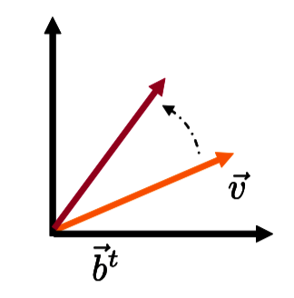
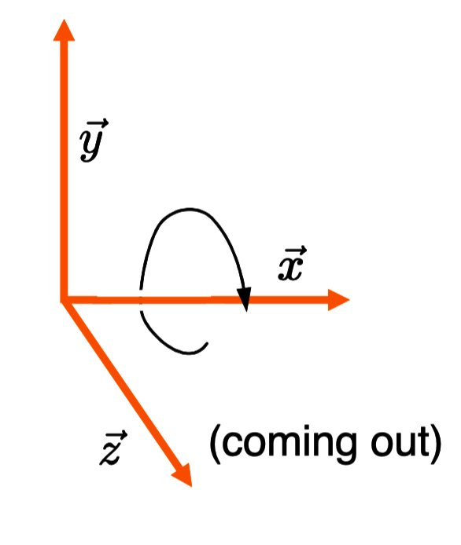

# Note
这是对**MIT.Foundation of 3D Computer Graphics**第2章的翻译，本章讲解了点、矢量、坐标系和旋转、伸缩等线性变换的基本概念，重点是基于矢量的线性变换相关知识内容。本书内容仍在不断的学习中，因此本文内容会不断的改进。若有任何建议，请不吝赐教ninetymiles@icloud.com 

> 注：文章中相关内容归原作者所有，翻译内容仅供学习参考。
> 另：Github项目[CGLearning](https://github.com/nintymiles/CGLearning)中拥有相关翻译的完整资料、内容整理、课程项目实现。

# 线性（Linear）
在学习3D计算机图形学（computer graphics）时，我们的首要任务是理解如何借助坐标表达点，同时如何对这些点应用几何变换。你非常可能在学习线性代数（linear algebra）课时已经看到了相似的材料，但是在计算机图形学中，我们经常同时使用多种不同的坐标系，因此我们需要特别注意多种坐标系所扮演的职责。总之，我们甚至对于这种基本材料的处理都会有一点儿不同于在线性代数课中所见到的。

在本章，我们会通过观察矢量（vectors）和线性变换（linear transformation）开始学习任务。矢量会被用于表达3D运动（motion）而线性变换将被用于在矢量上应用操作，诸如旋转（rotation）和伸缩（scaling）。在下面几章，我们会调查并行变换（affine transformation），其增加了平移物体的能力。到第六章之前，我们实际不会进行计算机图形学的编码处理（coding process）动作。我们的方法是首先仔细了解相关的理论，这些理论会让我们所需要内容的编码行为更加容易。

## 2.1 几何数据类型（Geometric Data Types）
想象某个在真实世界存在的特定的几何（地）点（geometric point）。这个点可以借用为3个实数被表达，
$$ \Large{ \begin{bmatrix}
  x \\ y \\ z
\end{bmatrix} }$$
我们称它为一个坐标矢量（coordinate vector）。这些数字关联于某种一致认可（agreed upon）的坐标系（coordinate system）指定了点的位置。这种一致任可的坐标系拥有某个一致任可的原点（origin point），同时还有3个一致认可的方向。如果我们要改变这个一致认可的坐标系，那么我们需要一个不同的数字集合，组成一个不同的坐标矢量，来描述相同的点。所以为了指定一个实际点的位置，我们既需要一个坐标系，也需要一个坐标矢量。这就暗示了我们实际要仔细区分下列概念：坐标系，坐标矢量，和几何点。

我们从4种数据类型开始，每个类型都拥有自己的标注方式（参考图示$\text{Figure 2.1}$）。

- 点（point）被标注为$\tilde{p}$，一个字母上方带一条波浪线。这是一个几何对象，不是一个数值对象。
- 矢量（vector）被标注为$\vec{v}$，一个字母上方带一个箭头。这也是一个非数值对象。第三章中我们将更详细地讨论矢量和点之间的区别。主要差异在点表示位置而矢量表示从一个点移动到另一个点的运动。
- 坐标矢量（coordinate vector）（这是由实数组成的数值对象）会被表示为一个粗体字母$\mathbf{c}$。
- 坐标系（coordinate system）（由抽象矢量集合组成，再一次，其为非数值对象）会被标注为$\vec{\mathbf{f}}^t$，它带有一个粗体字母，箭头和上标“t”。（我们用粗体表示一个垂直集合，上标“t”让其成为水平集合，还有箭头告诉我们这是一个矢量集合，而不是数值集合。）实际存在两种坐标系。基（basis）用于描述矢量，而帧（frame）用于描述点。我们对所有的坐标系使用相同的标注，然后通过上下文来区分其类型。

下面，我们将定义所有这些对象类型，并且考察什么操作可以施加在它们上面。当我们思考如何操纵几何物体，我们会重度使用数值对象（坐标矢量）和非数值对象（矢量和坐标系）这两者，同时也使用它们做符号计算。仅只在我们到第5章中证实了所有必需的约定公式后，我们才能够丢掉非数值对象，然后在我们的计算机代码中借助我们之前计算中的数值部分。

**Figure 2.1:** 几何数据类型：点被表示为圆点，矢量表示为箭头。矢量连接两个原点同时当平移时不被改变。帧（frame）表达一个坐标系，其由一个原点和一个由$d$个矢量组成的基构成。坐标矢量是实数的3元组。

## 2.2 矢量（Vectors），坐标矢量（Coordinate Vectors）, 和基（Bases）
让我们从明确地区分矢量和坐标矢量开始。本书中，矢量将总是一个抽象的几何实体（abstract geometry entity），其表达了世界中两点间的运动。这样一个矢量的实例会是“向东一英里”。坐标矢量是一个实数集合，一旦我们认可了一个坐标系，这个集合就可以用来指定一个矢量。

正式地讲，矢量空间（vector space）V是满足某些规则的某种矢量元素$\vec{v}$的集合。实际上我们需要定义一个加法操作，其接受两个矢量并将它们映射为第三个矢量。也需要定义一个标量（scalar）乘以一个矢量的乘法操作，其获得了另一个矢量。

要成为一个有效的矢量空间，还有大量其它规则必须要满足，这里我们不会太详细叙述这些规则。例如，加法操作必须是可组合的（associative）和可互换的（commutative）。另一个例子，标量乘法必须可跨矢量加法分布。
$$ \large{
	\alpha(\vec{v}+\vec{w}) = \alpha\vec{v}+\alpha\vec{w}
}$$
诸如此类等等，可参考书目[40]。

存在很多对象（object）家族，它们都拥有矢量空间的结构。但是在本书中，我们的兴趣在于由实际几何（地）点间的实际运动所构成的矢量空间。**实际上，我们不会将矢量看作是3个实数的集合。**

坐标系，或者称为基（basis），为一个小的矢量集合，从这个集合上可以借助矢量操作生成整个矢量集合。（更正式地，我们说如果存在标量$\alpha_1...\alpha_n$,使得$\Sigma_i\alpha_i\vec{b}_i=\vec{0}$,那么我们就称矢量集合$\vec{b}_1...\vec{b}_n$是线性依赖的（linearly dependent）。如果矢量集合不是线性依赖的，那么我们称它们为线性独立的（linearly independent）。如果$\vec{b}_1...\vec{b}_n$是线性独立的并且在其上我们可以借助加法和标量乘法生成矢量空间V的所有元素，那么集合$\vec{b}_i$被称为矢量空间V的基，同时我们说n为这个基或空间的维度。）针对空间中的自由运动，维度为3。我们也会称每个基矢量为一个轴（axis），实际上我们称第一个轴为x轴，第二个为y轴，第三个为z轴。

用基作用一种方式，我们可以生成空间中的任意矢量。这个矢量可以借助一个唯一的坐标集合$c_i$表示如下。
$$\large{ \vec{v} = \sum_i c_i\vec{b}_i }$$
我们可以借用矢量代数（vector algebra）标注方式将其写作
$$\large{ 
	\vec{v} = \sum_i c_i\vec{b}_i =
	\begin{bmatrix} \vec{b}_1 & \vec{b}_2 & \vec{b}_3 \end{bmatrix}
	\begin{bmatrix} c_1 \\ c_2 \\ c_3 \end{bmatrix} \qquad\qquad (2.1)
}$$
这个公式最右侧表达的解读可以借用线性代数中矩阵-矩阵乘法的标准规则。这里每一项$c_i\vec{b}_i$都是一个实数标量被一个抽象矢量相乘。我们可以生成一个简写方式，记为
$$\large{ \vec{v} = \vec{\mathbf{b}}^t\mathbf{c} }$$
这里$\vec{v}$是一个矢量，$\vec{\mathbf{b}}^t$为一行基矢量，$\mathbf{c}$为一（列）坐标矢量。

## 2.3 线性变换和$3\times3$矩阵（Linear Transformations and 3 by 3 Matrices）
线性变换$\mathcal{L}$只是从线性空间V到线性空间V的一种变换，满足下列两个属性。
$$\large{
\mathcal{L}(\vec{v}+\vec{u}) = \mathcal{L}(\vec{v})+\mathcal{L}(\vec{u}) \\ \mathcal{L}(\alpha\vec{v}) =\alpha\mathcal{L}(\vec{v})
}$$
我们借用标记$\vec{v} \Rightarrow \mathcal{L}(\vec{v})$表示矢量$\vec{v}$通过$\mathcal{L}$被变换为矢量$\mathcal{L}(\vec{v})$。

线性变换所对应的变换完全就是可用矩阵表达的这类变换。这是因为线性变换可以完全通过告知其在基矢量上的效果被指定。让我们考察一下这是如何起作用的：

变换的线性暗示了下列关系
$$ \large{
\vec{v} \Rightarrow \mathcal{L}(\vec{v}) = \mathcal{L}(\sum_i c_i\vec{b}_i)=\sum_i c_i\mathcal{L}(\vec{b}_i)
}$$

上面表达我们可以借助方程式（2.1）用矢量代数标记法写作
$$ \large{ 
 \begin{bmatrix} \vec{b}_1 & \vec{b}_2 & \vec{b}_3 \end{bmatrix}
	\begin{bmatrix} c_1 \\ c_2 \\ c_3 \end{bmatrix} 
\Rightarrow 
\begin{bmatrix} \mathcal{L}(\vec{b}_1) & \mathcal{L}(\vec{b}_2) & \mathcal{L}(\vec{b}_3) \end{bmatrix}
	\begin{bmatrix} c_1 \\ c_2 \\ c_3 \end{bmatrix}
 }$$

3个新矢量$\mathcal{L}(\vec{b}_i)$中的每个本身就是线性空间V中的一个元素，可以最终被写作用最初基矢量表达的某种线性组合。例如，使用某种合适的$M_{j,1}$值的集合，我们可以写
$$
\mathcal{L}(\vec{b}_1) = 
\begin{bmatrix} \vec{b}_1 & \vec{b}_2 & \vec{b}_3 \end{bmatrix}
	\begin{bmatrix} M_{1,1} \\ M_{2,1} \\ M_{3,1} \end{bmatrix}
$$
应用到所有的基矢量上，利用一个恰当的由9个实数组成的矩阵M，我们就获得
$$ \large{
\begin{bmatrix} \vec{b}_1 & \vec{b}_2 & \vec{b}_3 \end{bmatrix}
\begin{bmatrix}M_{1,1} & M_{1,2} & M_{1,3} \\ M_{2,1} & M_{2,2} & M_{3,2} \\ M_{3,1} & M_{3,2} & M_{3,3}\end{bmatrix}
}$$

将这些汇总到一起，我们明白应用到一个矢量上的线性变换操作可以被表示为：
$$ \large{ \begin{array}{c}
\begin{bmatrix} \vec{b}_1 & \vec{b}_2 & \vec{b}_3 \end{bmatrix}
	\begin{bmatrix} c_1 \\ c_2 \\ c_3 \end{bmatrix}  \\
\Rightarrow
\begin{bmatrix} \vec{b}_1 & \vec{b}_2 & \vec{b}_3 \end{bmatrix}
\begin{bmatrix}M_{1,1} & M_{1,2} & M_{1,3} \\ M_{2,1} & M_{2,2} & M_{3,2} \\ M_{3,1} & M_{3,2} & M_{3,3}\end{bmatrix}
	\begin{bmatrix} c_1 \\ c_2 \\ c_3 \end{bmatrix}
\end{array} }$$

总之，我们可以用一个矩阵把一个矢量变换为另一个
$$\large{ \vec{\mathbf{b}}^t\mathbf{c} \Rightarrow \vec{\mathbf{b}}^tM\mathbf{c} }$$
(参考图示$\text{Figure 2.2}$。）

如果我们对每个基矢量应用这种变换，我们得到一个新基。这个变换可以被表示为
$$ \large{
\begin{bmatrix} \vec{b}_1 & \vec{b}_2 & \vec{b}_3 \end{bmatrix}
\Rightarrow
\begin{bmatrix} \vec{b}_1 & \vec{b}_2 & \vec{b}_3 \end{bmatrix}
\begin{bmatrix}M_{1,1} & M_{1,2} & M_{1,3} \\ M_{2,1} & M_{2,2} & M_{3,2} \\ M_{3,1} & M_{3,2} & M_{3,3}\end{bmatrix}
}$$
或者简写为
$$\large{ \vec{\mathbf{b}}^t \Rightarrow \vec{\mathbf{b}}^tM }$$
(参考图示$\text{Figure 2.3}$。）

当然，用一个矩阵乘以一个坐标矢量的乘法也是有效的
$$\mathbf{c} \Rightarrow M\mathbf{c}$$

**Figure 2.2:** 矢量经历了线性变换$\vec{\mathbf{b}}^t\mathbf{c} \Rightarrow \vec{\mathbf{b}}^tM\mathbf{c}$。矩阵M依赖于被选择的线性变换。

**Figure 2.3:** 基经历了线性变换$\vec{\mathbf{b}}^t \Rightarrow \vec{\mathbf{b}}^tM$

## 2.3.1 同一和反转变换（Identity and Inverse）
同一映射（identity map）保留所有的矢量不变。其矩阵为同一矩阵（identity matrix）
$$ \large{
I = \begin{bmatrix} 1 & 0 & 0 \\ 0 & 1 & 0 \\ 0 & 0 & 1 \end{bmatrix}
}$$

矩阵$M$的反转是指存在唯一的矩阵$M^{-1}$，并且满足属性$MM^{-1}=M^{-1}M=I$。这种表达对应于矢量的反转变换。如果一个线性变换碰巧将多于一个的输入矢量转换为相同的输出矢量，那么这个变换将不是可反转的（invertible）同时其关联的矩阵不会有反转矩阵。在计算机图形学中，当我们选择从3D到3D的线性变换在空间中来回移动物体（也可以伸缩它们），使用一个不可反转的变换几乎没有意义。所以，除非被明确指出，本书中我们所处理的所有矩阵都可以反转。

## 2.3.2 用于基变化的矩阵（Matrices for Basis Changes）
在一对基或者矢量之间，矩阵除了被用于描述变换（$\Rightarrow$）关系之外，也可以用来描述相等（=）关系。实际上，在上面方程（2.2）中，我门已经看了这种形式的一种表达
$$\large{ \begin{array}{r}
\qquad\quad\vec{\mathbf{a}}^t = \vec{\mathbf{b}}^tM  \qquad\qquad(2.3) \\
\;\;\vec{\mathbf{a}}^tM^{-1} = \vec{\mathbf{b}}^t \qquad\qquad\quad(2.4)
\end{array} }$$
这其实表达了在指定的基$\vec{\mathbf{a}}^t$和$\vec{\mathbf{b}}^t$之间的相等关系。

假如在一个特定的基中，矢量用一个特定的坐标矢量表达为：$\vec{v}=\vec{\mathbf{b}}^t\mathbf{c}$。假设给出方程（2.3），你可以写作
$$\large{ \vec{v}=\vec{\mathbf{b}}^t\mathbf{c}=\vec{\mathbf{a}}^tM^{-1}\mathbf{c} }$$
这个表达不是一个变换（变换会使用$\Rightarrow$标注），而是一个相等关系（使用$=$标注）。我们只是借助两个基写了相同的矢量。坐标矢量$\mathbf{c}$关联于$\vec{\mathbf{b}}^t$表示矢量$\vec{v}$，而坐标矢量$M^{-1}\mathbf{c}$关联于$\vec{\mathbf{a}}^t$表示了完全相同的矢量$\vec{v}$。

## 2.4 附加的结构计算（Extra Structure）
3D空间中的矢量也装备了点积（dot product）操作
$$\large{ \vec{v}.\vec{w} }$$
其接收两个矢量然后返回一个实数。这种点积运算允许我们定义一个矢量的平方长（squared lengh），也被称作平方态（squared norm）
$$\large{ \|\vec{v}\|^2 = \vec{v}.\vec{v} }$$

点积和两个矢量之间的角度$\theta \in [0..\pi]$关联为
$$\large{ cos(\theta) = \frac{\vec{v}.\vec{w}}{\|\vec{v}\|\|\vec{w}\|} }$$

如果$ \vec{v}.\vec{w} = 0$,我们就说两个矢量正交（orthogonal）。

如果所有的基矢量都是单位长度并且每对正交，我们说一个基是正交标准化的（orthonormal）。

在一个正交标准化的基$\vec{\mathbf{b}}^t$中，计算两个矢量的点积$\vec{\mathbf{b}}^t\mathbf{c}.\vec{\mathbf{b}}^t\mathbf{d}$尤其容易。实际上，我们有

$$\large{ \begin{array}{rrl} 
\vec{\mathbf{b}}^t\mathbf{c}.\vec{\mathbf{b}}^t\mathbf{d} & \mbox{=} 
& (\sum_i \vec{b}_ic_i).(\sum_j \vec{b}_jd_j) \\
& \mbox{=} & \sum_i \sum_j c_id_j(\vec{b}_i.\vec{b}_j) \\
& \mbox{=} & \sum_i c_id_i 
\end{array} }$$

此处第二行中，我们使用点积（dot product）的双线性（bi-linearity）特征，而在第三行中我们使用基正交标准化（orthonormality）特性。

我们说一个2D正交标准基是右手性的（right handed），如果其第二个基矢量可以通过从第一个以90度反时针方向旋转获得的话（这里基矢量的顺序毫无疑问很重要）。

如果三个（有序的）基矢量按照图示$\text{Figure 2.4}$的方式排列，而不是相反地以图示$\text{Figure 2.5}$的方式排列，那么我们就说这个3D正交标准基是右手性的。实际上，在一个右手性的基中，如果你让右手张开，让手指指向第一个基矢量的方向，以这种方式弯曲你的手指使得它们指向第二个基矢量的方向，那么你的拇指将指向第三个基矢量的方向。

**Figure 2.4:** 右手性的正交标准坐标系。z轴正从页面中出来。同时展现的还有围绕x轴旋转的方向。

**Figure 2.5:** 左手性的正交标准坐标系。z轴正进入页面中。

在3D中，我们还有一个向量积（cross product）操作，其接收两个矢量同时输出一个按下面公式定义的矢量
$$ \large{
\vec{v} \times \vec{w} := \|\vec{v}\|\|\vec{w}\|sin(\theta)\vec{n}
}$$
此处$\vec{n}$是正交于$\vec{v}$和$\vec{w}$所跨越平面的单位矢量（unit vector），同时$[\vec{v},\vec{w},\vec{n}]$组成了一个右手性的基。

在一个右手性的正交标准基$\vec{\mathbf{b}}^t$中，两个矢量的向量积$\vec{\mathbf{b}}^t\mathbf{c} \times \vec{\mathbf{b}}^t\mathbf{d}$尤其容易计算，其关联于$\vec{\mathbf{b}}^t$的坐标可以被计算为
$$\large{ \begin{bmatrix}
c_2d_3-c_3d_2 \\ c_3d_1-c_1d_3 \\ c_1d_2-c_2d_1
\end{bmatrix} }$$

## 2.5 旋转（Rotations）
我们最常遇到的线性变换是旋转。旋转是一种保留了矢量间的点积并且将一个右手性的基映射到一个右手性的基的线性变换。所以在实际中，对一个右手性的正交标准基应用任何线性变换总是会得到另一个右手性的正交标准基。**在3D中，任何旋转都会固定一个旋转轴并且围绕其旋转某种角度**。

我们从描述2D情形开始，先关注一个矢量。
$$ \large{
	\vec{v} = \begin{bmatrix} \vec{b}_1 & \vec{b}_2 \end{bmatrix} 
	\begin{bmatrix} x \\ y \end{bmatrix}
}$$

让我们假设$\vec{\mathbf{b}}^t$为一个右手性的正交标准基。假如我们希望以$\theta$角度逆时针围绕原点旋转$\vec{v}$，旋转后矢量的坐标$[x',y']$，可以被计算为
$$ \large{
x' = xcos(\theta) - ysin(\theta) \\
y' = xsin(\theta) + ycos(\theta)
}$$
这个线性变换可以被写为下列的矩阵表达
$$ \large{
  \begin{array}{l}
	& \begin{bmatrix} \vec{b}_1 & \vec{b}_2 \end{bmatrix} 
	\begin{bmatrix} x \\ y \end{bmatrix}  \\
	\Rightarrow  & \begin{bmatrix} \vec{b}_1 & \vec{b}_2 \end{bmatrix} 
	\begin{bmatrix} cos(\theta) & -sin(\theta) \\ sin(\theta) & cos(\theta) \end{bmatrix} 
	\begin{bmatrix} x \\ y \end{bmatrix}
	\end{array}
}$$
同样，我们可以选择整个基为
$$ \large{
  \begin{array}{l}
	& \begin{bmatrix} \vec{b}_1 & \vec{b}_2 \end{bmatrix}  \\
	\Rightarrow  & \begin{bmatrix} \vec{b}_1 & \vec{b}_2 \end{bmatrix} 
	\begin{bmatrix} cos(\theta) & -sin(\theta) \\ sin(\theta) & cos(\theta) \end{bmatrix} 
	\end{array}
}$$

针对3D情形，我们同样假设我们正在使用一个右手性的正交标准坐标系。那么，围绕这个基的z轴进行$\theta$度的旋转可以表达为：
$$ \large{
  \begin{array}{l}
	& \begin{bmatrix} \vec{b}_1 & \vec{b}_2 & \vec{b}_3\end{bmatrix} 
	\begin{bmatrix} x \\ y \\ z \end{bmatrix}  \\
	\Rightarrow  & \begin{bmatrix} \vec{b}_1 & \vec{b}_2 \end{bmatrix} 
	\begin{bmatrix} c & -s & 0 \\ s & c & 0 \\ 0 & 0 & 1 \end{bmatrix} 
	\begin{bmatrix} x \\ y \\ z \end{bmatrix}
	\end{array}
}$$

此处，为了简化，我们借助标注$c:=cos(\theta)$和$s:=sin(\theta)$。和预期一样，这种旋转保持了矢量在第三个轴上的位置不变。在z值为常量的每个固定的平面上这种变换的表现和刚才描述的2D旋转一样。旋转方向可以用这种方式可视化，用右手抓住z轴，让手跟部（heel）正依靠着z=0平面；当你闭合手掌时，旋转前进方向的轨迹就被手指的运动描摹出来。

围绕x轴的旋转可以被计算为：
$$ \large{
  \begin{array}{l}
	& \begin{bmatrix} \vec{b}_1 & \vec{b}_2 & \vec{b}_3\end{bmatrix} 
	\begin{bmatrix} x \\ y \\ z \end{bmatrix}  \\
	\Rightarrow  & \begin{bmatrix} \vec{b}_1 & \vec{b}_2 \end{bmatrix} 
	\begin{bmatrix} 1 & 0 & 0 \\ 0 & c & -s  \\ 0 & s & c  \end{bmatrix} 
	\begin{bmatrix} x \\ y \\ z \end{bmatrix}
	\end{array}
}$$
再一次，旋转方向的可视化可以通过用右手抓住x轴，让手跟部（heel）抵住x=0平面；当合上手掌时，手指的运动方向就勾勒出了旋转前进方向的轨迹（参考图示$\text{Figure 2.4}$）。

围绕y轴的旋转可以借助下面的矩阵完成
$$ \large{ \begin{bmatrix}  c & 0 & s  \\  0 & 1 & 0 \\ -s & 0 & c  \end{bmatrix} }$$

在某种意义上，这也是要获得任意的3D旋转所有你需要的东西。首先，旋转的组合为另一个旋转。同时，它也表现为我们可以通过应用一个x轴，一个y轴和一个z轴旋转来合成随意的任何旋转。3个旋转的角度量被称为xyz-欧拉角(xyz-Euler angles)。欧拉角可以通过想象一个平衡环（gimbals）的方式来可视化，这种平衡环有3个可活动的轴，可以使用3种设置来确定任何想要得到的旋转（参考图示$\text{Figure 2.6}$）。

**Figure 2.6:** 通过恰当地设置3个轴中每一个的旋转数量，我们可以将金色盘放置为任何想要的方位。

还有一个表达一个随意旋转的更直接方式，就是挑选任意单位矢量$\vec{k}$作为旋转轴，同时直接围绕那个轴应用一个$\theta$度的旋转。让$\vec{k}$的坐标通过单位长度坐标矢量$[k_x,k_y,k_z]^t$给出。那么这个旋转可以借助下面的矩阵表达
$$ \large{ \begin{bmatrix}
k_x^2v+c & k_xk_yv-k_zs & k_xk_zv+k_ys \\
k_yk_xv+k_zs & k_y^2v+c & k_yk_zv-k_xs \\
k_zk_xv-k_ys & k_zk_yv+k_xs & k_z^2v+c 
\end{bmatrix} }$$
此处，为了简化，我们引入符号$v:=1-c$。反过来说，这个矩阵方程式也揭示了任何旋转都可以用这种形式表达。

我们注意到3D旋转的行为在某种程度上表现地有些复杂。两种围绕不同轴的旋转不能彼此互相交换。甚而，当我们组合两个围绕不同轴的旋转时，我们所得到的是一个围绕第三个轴的旋转！

随后在这本书中，我们会引入针对旋转的四元数（quaternion）表达，对于方位间的平滑过渡动画，这种表达会发挥用处。

## 2.6 伸缩（Scales）
为了建模几何物体，我们发现对矢量和基应用伸缩操作十分有用。要通过$\alpha$因子伸缩任何矢量，我们可以使用矩阵
$$ \large{
  \begin{array}{l}
	& \begin{bmatrix} \vec{b}_1 & \vec{b}_2 & \vec{b}_3\end{bmatrix} 
	\begin{bmatrix} x \\ y \\ z \end{bmatrix}  \\
	\Rightarrow  & \begin{bmatrix} \vec{b}_1 & \vec{b}_2 \end{bmatrix} 
	\begin{bmatrix} \alpha & 0 & 0 \\ 0 & \alpha & 0 \\ 0 & 0 & \alpha \end{bmatrix} 
	\begin{bmatrix} x \\ y \\ z \end{bmatrix}
	\end{array}
}$$

沿着3个轴方向以不同程度进行伸缩，我们可以使用更通用形式的矩阵
$$ \large{
  \begin{array}{l}
	& \begin{bmatrix} \vec{b}_1 & \vec{b}_2 & \vec{b}_3\end{bmatrix} 
	\begin{bmatrix} x \\ y \\ z \end{bmatrix}  \\
	\Rightarrow  & \begin{bmatrix} \vec{b}_1 & \vec{b}_2 \end{bmatrix} 
	\begin{bmatrix} \alpha & 0 & 0 \\ 0 & \beta & 0 \\ 0 & 0 & \gamma \end{bmatrix} 
	\begin{bmatrix} x \\ y \\ z \end{bmatrix}
	\end{array}
}$$

这种操作很有用处，例如，假定我们已经知道如何建模一个球体，我们就可以借助这种矩阵来建模一个椭球体。

