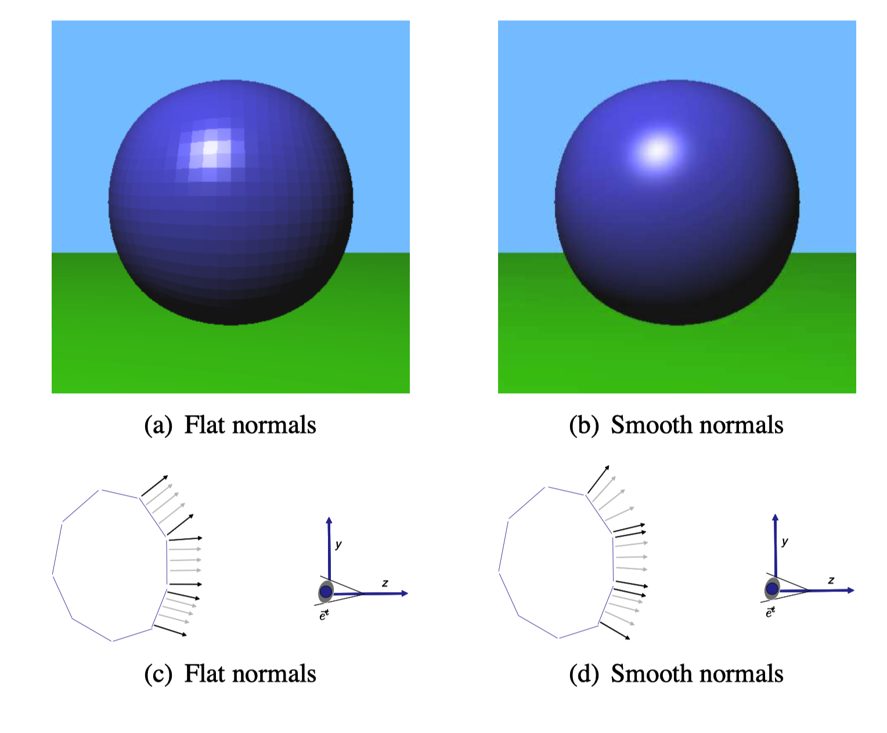

# Note
这是对**MIT Foundation of 3D Computer Graphics**第6章的翻译，本章讲解了如何使用现代OpenGL渲染管线方式利用矢量、线性变换等知识实现简单的3D绘制。本书内容仍在不断的学习中，因此本文内容会不断的改进。若有任何建议，请不吝赐教<ninetymiles@icloud.com>。 

> 注：文章中相关内容归原作者所有，翻译内容仅供学习参考。
> 另：Github项目[CGLearning](https://github.com/nintymiles/CGLearning)中拥有相关翻译的完整资料、内容整理、课程项目实现。

# Hello World 3D
我们终于要开始讲述,在前面章节中所学的帧（坐标系）和变换的概念是如何在交互式3D图像环境中实现的。阅读本章之前，你应该已经浏览了附录$A$，那里我们讲述如何设置基本的OpenGL程序。

## 6.1 坐标和矩阵（Coordinates and Matrices）
我们从使用`Cvec2,Cvec3,Cvec4`数据类型表达坐标矢量开始，坐标矢量的表达是很有用的。我们还需要实现两个相同尺寸`Cvec`类型`(u+v)`的加法，以及与一个实数标量r的乘法`(r*v)`。在`Cvec4`的情形中，我们称元素项为`x,y,z,w`。目前，`w`元素项对于点将总是为1，对于矢量总是为0。

接着，我们需要`Matrix4`数据类型表达仿射矩阵。我们需要支持右乘一个`Cvec4`，`(M * v)`，两个矩阵的乘法，`(M * N)`，反转操作`inv(M)`，和移项操作`transpose(M)`。

要生成有效的变换矩阵，我们使用下列操作

```cpp
Matrix4 identity(); 
Matrix4 makeXRotation(double ang); 
Matrix4 makeYRotation(double ang); 
Matrix4 makeZRotation(double ang); 
Matrix4 makeScale(double sx, double sy, double sz); 
Matrix4 makeTranslation(double tx, double ty, double tz);
```
（C++中，从默认构造器中返回同一矩阵，identity matrix，是有效的。）

要实现小节3.5和5.2.1的思路，我们需要操作`tranFact(M)`，其返回`Matrix4`只是表达`M`的平移因子，就如在方程（3.1）中，同时还有`linFact(M)`，其返回`Matrix4`类型只是表达`M`的线性因子。也就是说，`M = transFact(M) * linFact(M)`。

要实现小节3.6的思路，我们需要`normalMatrix(M)`操作，其只是$M$的线性因子的反转调换移项（存储在`Matrix4`的左上角）。

要实现小节5.2.1的思路，我们需要函数`doQtoOwrtA(Q,O,A)`，“关联于A对O实施Q变换”，其只是返回$AMA^{-1}O$。我们还需要函数`makeMixedFrame(O,E)`，其将$O$和$E$都分解并且返回$(O)_T(E)_R$。

## 6.2 绘制形状（Drawing a Shape）
首先，要实现3D绘制，我们需要在OpenGL中设置更多的状态变量

```cpp
static void InitGLState(){ 
	glClearColor(128./255., 200./255., 255./255., 0.); 
	glClearDepth(0.0); 
	glEnable(GL_DEPTH_TEST); 
	glDepthFunc(GL_GREATER); 
	glEnable(GL_CULL_FACE); 
	glCullFace(GL_BACK); 
}

```
这些调用的详细含义在这本书中随后被讲述。在`glClearColor`和`glClearDepth`调用中，我们不仅设置清理后的默认图像色彩，而且也设置默认的清理后的“z-缓存”值。我们还需要启用深度，或者称为z-缓存并且告知OpenGL“更大的z值”意味着"离眼睛更近"。z-缓存在第11章中被详细讨论。为了效率起见，我们还要告知OpenGL剔除任何背向眼睛的面（也就是说不绘制）。当图像中的顶点看起来以顺时针方向排列时，这个面就是背向面。背向面剔除在小节12.2中被详细讨论。

现在返回主题。我们使用全局变量`Matrix4 objRbt`表达刚体矩阵，其将物体的正交标准帧关联到世界帧，就如在表达式$\vec{\mathbf{o}}^t=\vec{\mathbf{w}}^tO$中一样。我们使用全局变量`Matrix4 eyeRbt`表达刚体矩阵$E$，其关联物体的正交标准帧到世界帧，就如在表达式$\vec{\mathbf{e}}^t = \vec{\mathbf{w}}^tE$中一样。

让我们观察下面绘制两个三角形和一个立方体的代码碎片。

地面是由两个三角形构成的一个正方形。立方体由六个正方形构成，也就是说，12个三角形。针对每个顶点，我们存储其位置和法线矢量的3D物体坐标。所有这种数据相似于附录A中所完成的情形。

```cpp
GLfloat floorVerts[18] = {
-floor_size, floor_y, -floor_size, 
floor_size, floor_y, floor_size, 
floor_size, floor_y, -floor_size,
-floor_size, floor_y, -floor_size,
-floor_size, floor_y, floor_size, 
floor_size, floor_y, floor_size 
}; 

GLfloat floorNorms[18] = { 0,1,0, 0,1,0, 0,1,0, 0,1,0, 0,1,0, 0,1,0 };

GLfloat cubeVerts[36 * 3]= {
-0.5, -0.5, -0.5,
-0.5, -0.5, +0.5, 
+0.5, -0.5, +0.5,
// 33 more vertices not shown 
};

// Normals of a cube. 
GLfloat cubeNorms[36 * 3] = { 
+0.0, -1.0, +0.0, 
+0.0, -1.0, +0.0, 
+0.0, -1.0, +0.0,
// 33 more vertices not shown
};
```

我们现在初始化顶点缓存对象（VBOs），其为顶点数据集合的句柄（handles），诸如顶点位置和法线。

```cpp
static GLuint floorVertBO, floorNormBO, cubeVertBO, cubeNormBO;

static void initVBOs(void){

glGenBuffers(1,&floorVertBO); 
glBindBuffer(GL_ARRAY_BUFFER,floorVertBO);
glBufferData( GL_ARRAY_BUFFER, 18 * sizeof(GLfloat), floorVerts, GL_STATIC_DRAW);

glGenBuffers(1,&floorNormBO); glBindBuffer(GL_ARRAY_BUFFER,floorNormBO); 
glBufferData( GL_ARRAY_BUFFER, 18 * sizeof(GLfloat), floorNorms, GL_STATIC_DRAW);

glGenBuffers(1,&cubeVertBO); 
glBindBuffer(GL_ARRAY_BUFFER,cubeVertBO); 
glBufferData( GL_ARRAY_BUFFER, 36 * 3 * sizeof(GLfloat), cubeVerts, GL_STATIC_DRAW);

glGenBuffers(1,&cubeNormBO); glBindBuffer(GL_ARRAY_BUFFER,cubeNormBO); 
glBufferData( GL_ARRAY_BUFFER, 36 * 3 * sizeof(GLfloat), cubeNorms, GL_STATIC_DRAW);

}
```

我们使用其位置和法线VBOs绘制物体如下

```cpp
void drawObj(GLuint vertbo, GLuint normbo, int numverts){

glBindBuffer(GL_ARRAY_BUFFER,vertbo); 
safe_glVertexAttribPointer(h_aVertex); safe_glEnableVertexAttribArray(h_aVertex);

glBindBuffer(GL_ARRAY_BUFFER,normbo); 
safe_glVertexAttribPointer(h_aNormal); safe_glEnableVertexAttribArray(h_aNormal);
glDrawArrays(GL_TRIANGLES,0,numverts);

safe_glDisableVertexAttribArray(h_aVertex); safe_glDisableVertexAttribArray(h_aNormal);

}
```

我们现在可以观察我们的显示函数**display**。

```cpp
static void display(){

safe_glUseProgram(h_program_);
glClear(GL_COLOR_BUFFER_BIT | GL_DEPTH_BUFFER_BIT);

Matrix4 projmat = makeProjection(frust_fovy, frust_ar, frust_near,frust_far); 
sendProjectionMatrix(projmat);

Matrix4 MVM = inv(eyeRbt); 
Matrix4 NMVM = normalMatrix(MVM); 
sendModelViewNormalMatrix(MVM,NMVM);

safe_glVertexAttrib3f(h_aColor, 0.6, 0.8, 0.6); drawObj(floorVertBO,floorNormBO,6);

MVM = inv(eyeRbt) * objRbt; 
NMVM = normalMatrix(MVM); 
sendModelViewNormalMatrix(MVM,NMVM);

safe_glVertexAttrib3f(h_aColor, 0.0, 0.0, 1.0); drawObj(cubeVertBO,cubeNormBO,36);

glutSwapBuffers(); 

if (glGetError() != GL_NO_ERROR){
	const GLubyte * errString;
	errString=gluErrorString(errCode);

	printf("error: %s\n", errString); 
}

}
```

`makeProjection`返回描述“虚拟相机”内部的特殊种类的矩阵。相机被几个参数-视域、窗口纵横比率、以及所谓的近值和远值-所描述。`sendProjectionMatrix`把这种“相机矩阵”发送到顶点着色器，并且将其放置在被命名为`uProjMatrix`的变量中。我们在后面章节中会学习更多关于这个矩阵的内容，但是现在，你只要在本书的网站上找到这个代码即可。

在我们的程序中，存储在一个VBO中的顶点坐标为顶点的物体坐标。因为渲染器最终需要眼睛坐标，我们将矩阵$E^{-1}O$也发送到API。这种矩阵经常被称作MVM或者模型视图矩阵。（要绘制地面，我们使用$O=I$）。顶点着色器（下面会讲述），会采纳这种顶点数据并且执行乘法$E^{-1}O\mathbf{c}$产生用于渲染的眼睛坐标。同样地，用于法线的所有坐标，需要被乘以一个关联的法线矩阵，其允许我们从物体坐标变换到眼睛坐标。

我们的程序`sendModelViewNormalMatrix(MVM,NMVM)`将MVM和法线矩阵发送到顶点着色器，并且把它们放置在被命名为`uModelViewMatrix`和`uNormalMatrix`的变量中。

顺便一提：在计算机图形中，被挂载到三角形一个顶点的法线矢量，随后被用于着色，不必须是扁平三角形的真正几何法线。例如，如果我们使用三角形网格以近似的方式绘制一个球体形状，我们可能想让三角形的三个顶点3个有区别的法线，要更好匹配球体的形状（参考图示$\text{Figure 6.1}$）。在着色图片中这会导致更平滑和更少曲面细分的外观。如果我们要使各个面看起来扁平，就好像一个立方体的各个面，那么我们就把每个三角形的实际几何法线传递给OpenGL。

对`safe_glVertexAttrib3f`的调用传递了3个浮点数到顶点着色器中被“指向”到句柄（handle）`h_aColor`的变量，这个句柄“指向”顶点着色器中被命名为`aColor`的属性变量。任何属性变量的设置保留有效直到其被另一个`safe_glVertexAttrib3f`调用所设置。如此除非被改变，它会被绑定到每个随后的顶点上。借助顶点着色器，被发送到`aColor`变量的数据可以使用任何我们想要的方式来解读。在我们的情形中，会将这种数据解读为顶点的“rgb色彩”坐标。


**Figure 6.1:** 在图像中，我们可在顶点处随意指定任何我们所希望的法线。这些法线（就像所有属性变量）针对三角形内的所有点被插值。在我们的碎片着色器中我们可以使用这些被插值的法线模拟光照并且确定色彩。当三角形的真实法线被给出时，我们会获得一个嵌入的外观。如果我们指定法线近似某种底层的平滑形状，我们将获得一个平滑外观的渲染。

## 6.3 顶点着色器（The Vertex Shader）
我们的顶点着色器采用每个顶点位置的物体坐标，然后把它们变为眼睛坐标，就如在小节5.1中所描述。它同样变换顶点的法线坐标。

这里为顶点着色器的完整代码：

```glsl
#version 330

uniform Matrix4 uModelViewMatrix; 
uniform Matrix4 uNormalMatrix; 
uniform Matrix4 uProjMatrix;

in vec3 aColor; 
in vec4 aNormal; 
in vec4 aVertex;

out vec3 vColor; 

out vec3 vNormal; out vec4 vPosition;

void main() { 
	vColor = aColor; 
	vPosition = uModelViewMatrix * aVertex; 
	vec4 normal = vec4(aNormal.x, aNormal.y, aNormal.z, 0.0); 
	vNormal = vec3(uNormalMatrix * normal); 
	gl_Position = uProjMatrix * vPosition; 
}
```
这个着色器非常易于理解。其不改变地传递色彩变量`aColor`到输出的`vColor`。执行矩阵-矢量乘法将物体坐标转换为眼睛坐标，并且把它们发送到输出（变量）。
 
同时执行矩阵-矢量乘法将法线的物体坐标转换为眼睛坐标并且把这些发送到输出（变量）。

最终它使用特殊的（并且目前仍然没有被完整解释过的）相机投射矩阵以获得新种类的被称作顶点的裁切坐标，并将其作为输出发送到`gl_Position`。在这种情形中，不像我们在附录A中所看到的更简单的代码，`gl_Position`实际为4部件坐标矢量。在第10-12章，我们会更深入确切地讨论裁切坐标数据如何被用于放置顶点到屏幕之上。

## 6.4 接下来发生的事情（What Happens Next）
OpenGL接下来对顶点着色器的输出所做事情的细节会在之后的章节中会被讲述。几乎每个随后的段落都将需要被扩展为完整的章节以解释所要发生的事情。但是现在，这里就是我们需要知道的主要内容。

裁切坐标被渲染器用于确定在屏幕上的具体位置放置顶点，从而决定三角形会被绘制在哪里。一旦OpenGL获得组成一个三角形的3个顶点的裁切坐标，其会计算屏幕上哪些像素落入三角形之内。针对每个这种像素，它决定这个像素距离3个顶点中的每个有多么“远离”。这被用于决定如何混合或者在3个顶点的变异变量上插值。

在每个像素上被插值的变量随后被写着色器的用户所使用，着色器针对每个像素被独立调用。下面是最简单可能的碎片着色器：

```glsl
in vec3 vColor; 
out fragColor; 
void main() { 
	fragColor = vec4(vColor.x, vColor.y, vColor.z, 1.0); 
}

```
这个着色器接收针对这个像素被插值的色彩数据，然后将其发送到输出的变量`fragColor`。这随后被发送到屏幕作为像素的色彩。（关于这第四个值1.0，被称作alpha，或者透明度值，并且目前仍不会引起我们的关注。）裁切坐标也被用于决定三角形离屏幕有多远。当z-缓存被开启，这种信息被用于确定，在每个像素上，哪个三角形最接近并且因而被绘制。因为这个决定以逐像素方式在一个像素上被做出，甚至复杂的互相渗透的三角形排列会被正确绘制。

注意当使用上面的碎片，我们没有使用变异变量`vPosition`和`vNormal`，并且在这种情形中，并不真正要发送它们为顶点着色器中的输出变量。下面为一个稍微更复杂和更真实的使用这种数据的着色器。

```glsl
#version 330

uniform vec3 uLight; 
in vec3 vColor; 
in vec3 vNormal; 
in vec4 vPosition;

out fragColor;

void main() { 
	vec3 toLight = normalize(uLight - vec3(vPosition)); 
	vec3 normal = normalize(vNormal); 
	float diffuse = max(0.0, dot(normal, toLight)); 
	vec3 intensity = vColor * diffuse; 
	fragColor = vec4(intensity.x, intensity.y, intensity.z, 1.0); 
}
```
此处我们假设`uLight`为点光源的眼睛坐标，并且在我们的主程序中，这个数据已经借助使用相应的`safe_glVertexUniform3f`调用被恰当地传递到着色器中。存储于`vNormal`和`vPosition`变量中的数据，对于`vColor`相关的数据，会被从顶点数据上插值。因为插值被完成的方式，`vPosition`中的数据表达了在这个像素上被看到的三角形内的几何点。其余代码做了一个简单计算，计算多个矢量并且执行点积。目标是模拟漫射的反射或模糊（和明亮对立）材料。我们会在第14章中重提这种计算的细节。

## 6.5 使用矩阵定位和移动（Placing and Moving With Matrices）
返回我们最初的代码，所剩下的就是初始化`eyeRbt`和`objRbt`变量并且同时解释我们如何更新它们。在这种简单情形中，我们可以开始于代码

```cpp
Matrix4 eyeRbt = makeTranslation(Vector3(0.0, 0.0, 4.0)); 
Matrix4 objRbt = makeTranslation(Vector3(-1,0,-1)) * makeXRotation(22.0);
```
在这种情形中，我们的所有帧开始于和世界帧的轴对齐的帧。眼睛帧被关联于世界帧的z轴平移+4单位。回忆一下，我们的“相机”正看向眼睛帧的负z轴，因而眼睛正看向世界帧的原点。物体帧在世界帧中被向后和向“左侧”平移一点并且围绕自己的x轴旋转。观察图像$\text{Figure 5.1}$。

现在让我们允许用户移动物体，回忆在附录A中所记录的运动回调函数，我们计算水平增量`deltax`。其为当鼠标左键被摁下时的鼠标移位。垂直移位能够同样地被计算。

我们现在可以添加下列行到运动函数中以移动物体。

```cpp
Matrix4 Q = makeXRotation(deltay) * makeYRotation(deltax); 
Matrix4 A = makeMixedFrame(objRbt,EyeRbt); 
objRbt = doQtoOwrtA(Q, objRbt, A);
```
我们也可以使用鼠标运动增强运动函数，当右键被摁下，要平移物体，可以使用代码`Q=makeTranslation(Vector3(deltax, deltay, 0) * 0.01)`

当中键被摁下时，我们能够用鼠标运动平移物体更近和更远，使用代码
`Q=makeTranslation(Vector3(0, 0, -deltay) * 0.01)`

如果我们希望借助辅助帧移动眼睛，那么我们使用代码：`eyeRbt = doQtoOwrtA(inv(Q), eyeRbt, A)`.

如果我们希望执行自我运动（ego motion），就如同我们转动头，那么我们使用代码：

```cpp
eyeRbt = doQtoOwrtA(inv(Q), eyeRbt, eyeRbt).
```
在最后两种情形的每一种中，我们都会反转Q以便鼠标运动在我们更想要的方向上产生图像运动。

