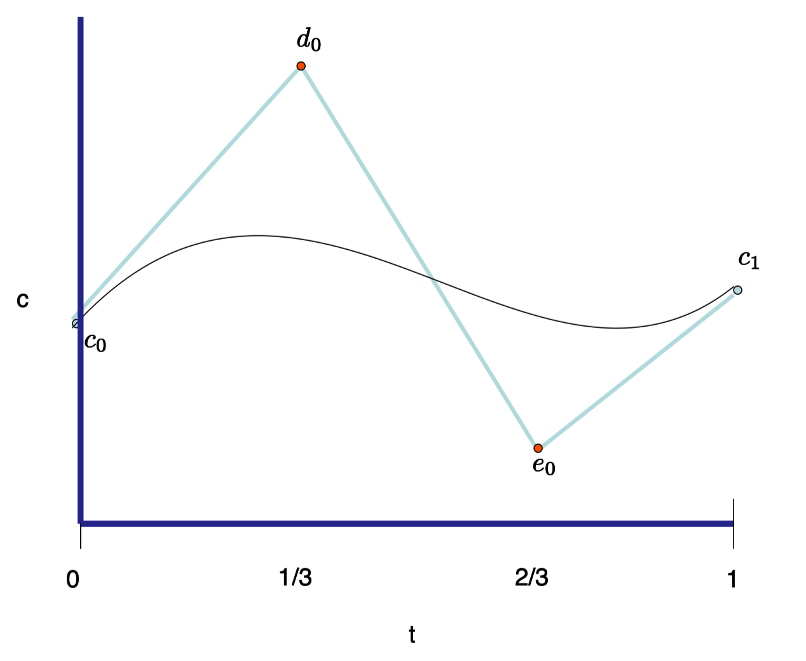
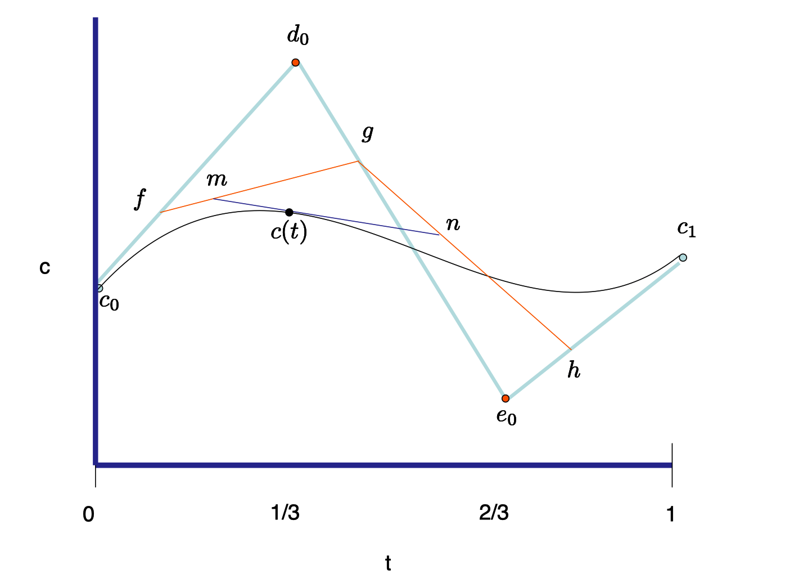
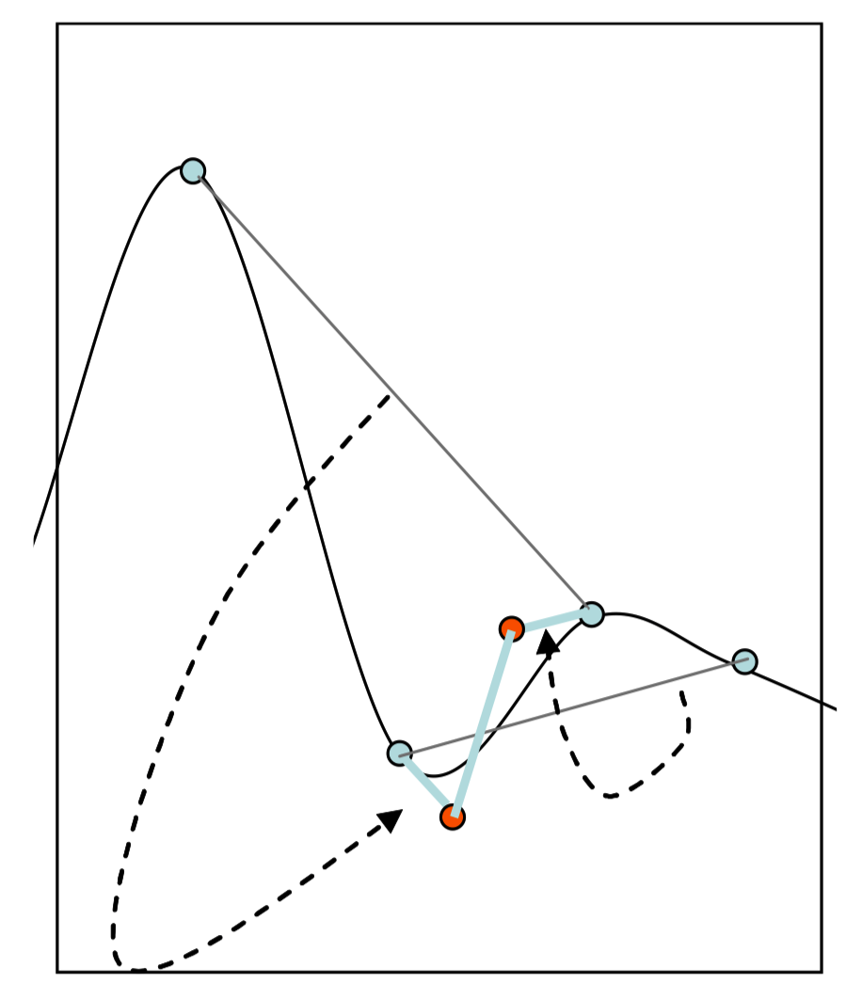
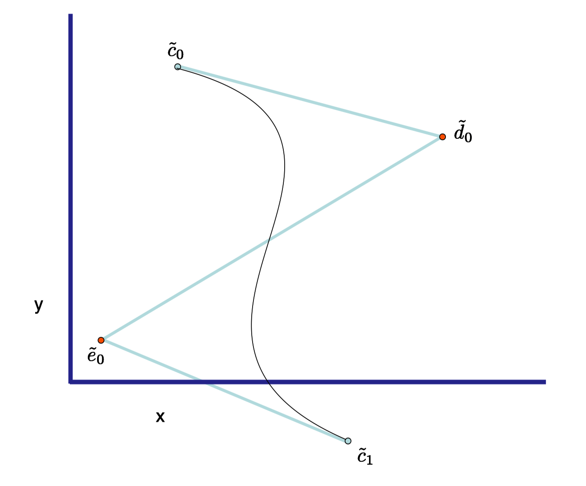
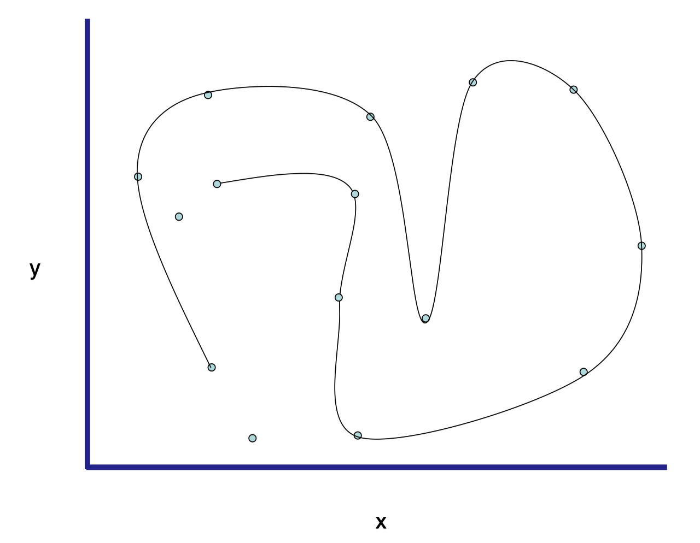

# Note
这是对**Foundation of 3D Computer Graphics**第9章的翻译，本章讲解了平滑插值的基本概念以及贝塞尔函数和样条函数的使用。本书内容仍在不断的学习中，因此本文内容会不断的改进。若有任何建议，请不吝赐教<ninetymiles@icloud.com>。

> 注：文章中相关内容归原作者所有，翻译内容仅供学习参考。
> 另：Github项目[CGLearning](https://github.com/nintymiles/CGLearning)中拥有相关翻译的完整资料、内容整理、课程项目实现。

# 平滑插值（Smooth Interpolation）
让我们考虑一种被称为关键帧动画（keyframe animation）的技术。在这种环境中，一个动画绘制器（animator）会描述位于一系列具体时刻之上的3D计算机图形动画的快照（snapshot）。每个快照（snapshot）根据某种集合的建模参数被定义。这些参数可能包含很多对象的位置（locations）和方位（orientations）信息，当然也包含相机的位置和方位信息。除此还包含模型活动部件的关节角度等信息。要从这些关键帧生成平滑动画，计算机的工作就是在连续的时间范围上平滑地“填入”参数值。如果一个这种动画参数被称为$c$，那么我们的每个具体快照（snapshot）可被称为$c_i$,此处$i$为某种范围的整数，那么我们的工作就是将这个参数的快照（snapshots）转变为一个关于时间的连续函数(continuous function)，$c(t)$。我们通常想让函数$c(t)$足够平滑，以便生成的动画不会显得太断断续续。

在本章中，我们会讨论在位于局部实数范围上的这样一套具体值上平滑插值的简单方式，这些方式一般借助样条（splines）函数。举个例子，在图示$\text{Figure 9.1}$中我们展示了一个函数$c(t)，t \in [0..8] $,这个函数在关联于整数值$c_i,i \in -1..9 $的具体值上插值，它们被展示为蓝色点（具体对额外的不参与插值的在-1和9处的具体值的需求随后澄清）。我们的样条（splines）函数将由独立的块函数（piece functions）组成，这里每个块函数是某种低等多项式函数。这些多项式块函数会被专门挑选以便它们可以平滑地”缝合在一起“。样条（splines）函数经常被用于计算机图形中，因为它们易于表达，评估和控制。实际上，它们的行为相比单一的高等多项式函数要容易预测得多。

我们也会展示这样的样条（splines）函数表达如何被用于描述空间和平面中的曲线。这样的曲线有超越动画之外的许多用途。例如，它们可以在字体中被用于描述字符形状的轮廓。

**Figure 9.1:** 一个样条（spline）函数被用来在一系列被展示为点的控制值上平滑插值。

## 9.1 立方贝塞尔函数（Cubic Bezier Functions）
我们通过观察如何表达一个立方多项式函数$c(t),t \in [0..1]$(参考图示$\text{Figure 9.2}$)开始。有很多可能的方式可以做这件事情，此处我们描述贝塞尔（Bezier）表达方法。这是一种方便的表达，其中的参数拥有几何解释，并且评估减弱为重复的线性插值。

**Figure 9.2:** 一个贝塞尔（Bezier）函数由4个控制值所确定。

在立方贝塞尔表达法（cubic Bezier representation）中，一个立方函数被4个称为控制值（control value）的数值$c_0,d_0,e_0,c_1$所描述。在图示$\text{Figure 9.2}$中，我们可在2D(t,c)平面可视化这种数据为点，这些点拥有坐标$[0,c_0],[1/3,d_0],[2/3,e_0],[1,c_1]$。我们同时以浅蓝色绘制一个由连接这些点所形成的折线（poly-line）；这条折线被称为控制多边形（control polygon）。

要评估在任何t值上的函数c(t)，我们执行下面的线性插值序列：

$$\begin{array}{rclr}
  f &=& (1 − t)c_0 + td_0 & (9.1) \\
	g &=& (1 − t)d_0 + te_0 & (9.2) \\
	h &=& (1 − t)e_0 + tc_1 & (9.3) \\
   m &=& (1 − t)f + tg  & (9.4) \\
   n &=& (1 − t)g + th  & (9.5) \\
c(t) &=& (1 − t)m + tn & (9.6) \\
\end{array}$$

在图示$\text{Figure 9.3}$中，当t=0.3时，我们可视化这种计算步骤为2D空间中的线性插值。

**Figure 9.3:** 对于任何t变量值，贝塞尔（Bezier）函数可以通过由本图所可视化的一系列线性插值步骤所评估。

### 9.1.1 属性（Properties）
很容易验证函数c(t)具有下列属性。

通过展开上面的评估步骤，我们可以证实函数c(t)具有下面的形式：

$$c(t)= c_0(1 − t)^3 + 3d_0t(1 − t)^2 + 3e_0t^2(1 − t) + c_1t^3$$

清晰无误地，这是一个立方函数。更进一步，$c_i$被函数插值：$c(0)=c_0$ 和 $c(1)=c_1$。通过推导，我们看到 $c'(0) = 3(d_0-c_0) $ 和 $ c'(1) = 3(c_1-e_{0})$。在图示$\text{Figure 9.2}$中，我们确实观察到c(t)函数的斜率（slope）匹配在0和1处控制多边形（control polygon）的斜率。我们也可以看到如果我们设置$c_0 = d_0 = e_0 = c_1 = 1$，那么对于所有的t值，函数c(t)=1。这种属性被称作一致性分区（partition of unity），那么这意味着为所有的控制值（control value）增加一个常量值也仅相当于给函数c(t)增加这个常量值。

### 9.1.2 平移（Translation）
如果我们想获得一个立方函数，这个函数分别在t = i和t = i+1上的具体值$c_i$和$c_{i+1}$上插值，同时调用另外两个控制点$d_i$和$e_i$，我们仅需“平移”方程（9.1）的评估算法以获得下面的评估步骤：

$$\begin{array}{rclr}
f &=& (1 − t + i)c_i + (t-i)d_i & (9.7) \\
g &=& (1 − t + i)d_i + (t-i)e_i & (9.8) \\
h &=& (1 − t + i)e_i + (t-i)c_{i+1} & (9.9) \\
m &=& (1 − t + i)f + (t-i)g & (9.10) \\
n &=& (1 − t + i)g + (t-i)h  & (9.11) \\
c(t) &=& (1 − t +i)m + (t-i)n & (9.12) \\
\end{array}$$

## 9.2 Catmull-Rom样条函数（Catmull-Rom Splines）
让我们返回在一系列具体值$c_i,i \in -1..n+1$上插值的最初问题。做这个事情的简单方式是借助Catmull-Rom样条函数（Catmull-Rom Splines）。这个方法定义了一个针对变量$t \in [0..n]$的函数$c(t)$。这个函数被$n$个立方函数定义，每个在$t \in [i..i+1]$的单位区间上被支持。块函数（piece）被选定在$c_i$值上插值，同时满足它们的第一推导。

每个块函数在其贝塞尔表达（Bezier represesntation）方式中，借助4个控制值：$c_i,d_i,e_i$和$c_{i+1}$被确定。根据我们的输入值。要设置$d_i$和$e_i$的值，我们施加约束$c′(t)|_i = \frac{1}{2} (c_{i+1} − c_{i−1} )$。换句话说，我们向前和向后各寻找一个样例以决定t=i处的斜率；这是为什么我们需要额外的边缘值（extreme values）$c_{-1}$和$c_{n+1}$的原因。因为在贝塞尔表达（Bezier representation）中$c'(i) = 3(d_i-c_i) = 3(c_i-e_{i-1}) $，这其实告诉我们需要做如下设置：

$$\begin{array}{rcl}
d_i &=& ((c_{i+1}c_{i−1}^{−1} )^\frac{1}{6})c_i  & (9.13)\\
e_i &=& ((c_{i+2}c_{i}^{−1} )^\frac{-1}{6})c_{i+1} & (9.14)\\
\end{array}$$

这个处理在图示$\text{Figure 9.4}$中被可视化表达。在这里我们展示了一个立方函数线段所需的控制值c，d和e（其中d和e以红色表示）。我们以浅蓝色展示了一个立方块函数（cubic piece）的控制多边形。控制值d和e借助深蓝色展示的弦（chords）被确定。

**Figure 9.4:** Catmull-Rom样条函数（Catmull-Rom spline function）由多个独立的块函数（piece）构成。每个块函数可以用贝塞尔（Bezier）形式表达。这里我们展示了一个贝塞尔形式如何通过输入的控制值被确定。箭头指向的线段拥有相同的斜率。 

## 9.3 四元数样条化（Quaternion Splining）
贝塞尔（Bezier）和Catmull-Rom表达可用于在任何实数值化的动画参数上插值。例如，如果我们有一个随时间变化的平移，那么3个定义的平移参数$t_x,t_y$和$t_z$可以独立地被插值。

如果我们想要在一系列方位上插值，这种理论（Catmull-Rom和Bezier表达）不能直接应用。有一些关于在这种情形中使用的最佳理论方式的研究正在进行。一种有效的手段是仅仅针对上面的标量（scalar）操作替换为恰当的四元数（quaternion）操作。借助这些替换，标量（scalar）加法变为四元数（quaternion）乘法，标量（scalar）负操作变为四元数（quaternion）反转（倒数操作），标量（scalar）乘法变为四元数（quaternion）幂操作。如此进行，这种形式的贝塞尔（Bezier）评估步骤：
$$r = (1 − t)p + tq$$ 
变为 
$$r = slerp(p, q, t)$$
同时 $d_i$和$e_i$四元数（quaternion）的值被定义如下：
$$ 
\begin{array}{rl}  
d_i &=& ((c_{i+1}c_{i−1}^{−1} )^\frac{1}{6})c_i \\ 
e_i &=& ((c_{i+2}c_{i}^{−1} )^\frac{-1}{6})c_{i+1}  
\end{array}
$$

正如在小节7.4中所述，为了在“短路径”上插值，如果四元数（quaternion）$c_{i+1}c_{i-1}^{-1}$的第一个坐标值为负，在应用幂操作符之前，我们先将其负化。

其它基于四元数样条（quaternion spline）的slerp方法在参考书目[68]和[66]中被讲述。另一种更自然的但是更昂贵的基于n路球体混合的方法在参考书目[10]中被讲述。

还有一种可选的，经常在实践中使用的方法，这种方法只是将四元数（quaternions）看作$R^4$空间中的点，在这些点坐标上做标准的样条化（splining）动作，随后标准化结果以获得单位态四元数（unit-norm quaternion）。在这种上下文中，用于线段间连续性的条件在参考书目[22]中被描述。

## 9.4 其它样条函数（Other Splines）
存在很多其它类型的样条函数（spline function），它们的名字我们将会提及，因为你可能偶然会碰到这些函数，但是我们不会深入细节。这些样条函数在计算机辅助几何设计领域被重度研究。有兴趣的读者可能希望阅读参考书目[21]和[59]。

自然立方样条（natural cubic spline）函数在其控制值上插值并且最小化第二推导的积分。这样一种样条（spline）在某种意义上是“最平滑的”插值体。其证实了自然立方样条（natural spline）由满足第一和第二推导的立方块函数（piece）构成。需要求解一个线性方程式系统以确定这样一种自然立方样条函数。这种样条函数的行为是全局性的：移动一个控制值将影响整个范围的函数值。

均匀（立方或3次）B样条函数表达了借助由一个集合的为了同时满足第二推导而被缝合在一起的3次（立方）多项式所构成的函数。不像自然3次样条函数，这个函数随着控制值的变化只会局部变动。然而，一个B样条，并不在任何控制值上插值，而只是近似它们。

非均匀B样条是均匀B样条的泛化，其允许在变量t的集合上的不平均的控制值间隔，并同时维护两度连续性。

最后，非均匀有理B样条（或称NURB）是非均匀B样条的泛化，在其上每个“块函数（piece）”是一种两个多项式函数的有理数（一种比率）表示。这种有理数形式允许你建模很多经典代数形状。

## 9.5 空间中的曲线（Curves in Space） ......
出于动画的目的，我们已经观察了单变量标量（scalar）函数（这里我们将自由变量当作时间）。你可以使用样条（spline）表达描述空中的曲线。在这种情形中，样条曲线被一系列2D或3D空间中的控制点$\tilde{c}$所控制。针对x、y和z坐标独立应用样条构造函数，你可以获得一个点值化的样条函数$\tilde{c}(t)$；你可以将它当作一个随时间飞过空中的点，勾勒出样条曲线，$\gamma$。

借助用4个控制点表达的贝塞尔构造（Bezier construction），我们获得一个贝塞尔（Bezier）曲线（参考图示$\text{Figure 9.5}$，然而借助在控制点之上的Catmull-Rom构造，我们可以获得一个Catmull-Rom曲线（参考图示$\text{Figure 9.5}$）。

在曲线的上下文环境中，一致性分区（partition of unity）属性暗示如果你使用某种固定数量平移所有的控制点，那么这会导致以那个数量平移$\gamma $曲线。

另外，对于贝塞尔（同时还有B样条）曲线，针对每个t变量，函数值$\tilde{c}(t)$通过控制点的某种位置混合而获得，这里的混合量总是位于0和1之间。总之，曲线必须位于由连接空间中的点所定义的控制多边形的“顶壳（convex hull）”之内。这暗示曲线将不会漫游太远从而超出控制多边形的范围。

**Figure 9.5:** 2D空间中的贝塞尔（Bezier）曲线。

**Figure 9.6:** 2D空间中的Catmull-Rom曲线。

