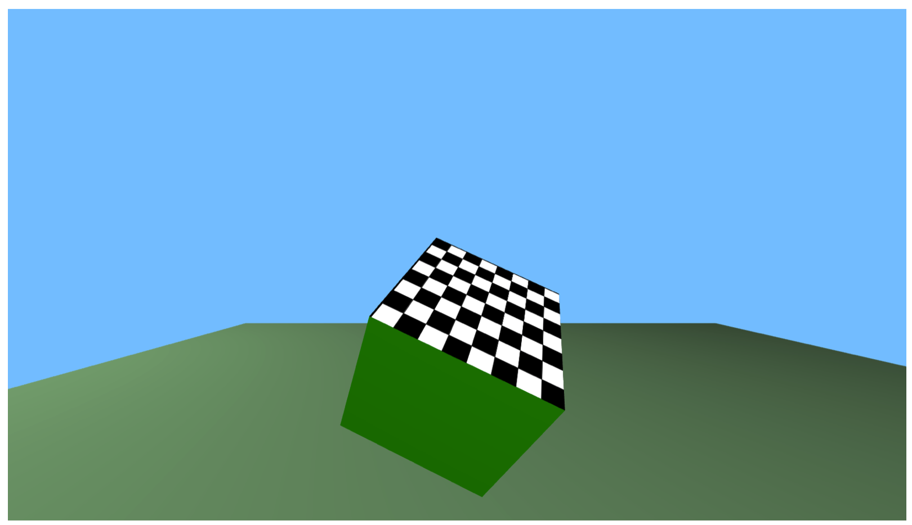
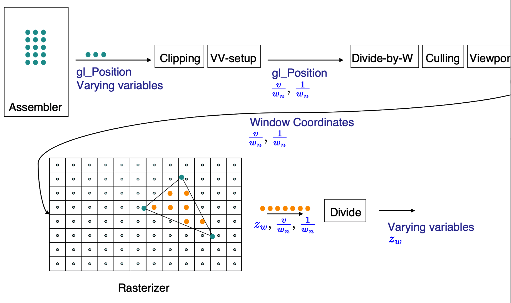

# Note
这是对**MIT Foundation of 3D Computer Graphics**第13章的翻译，本章讲解了变异变量（varying variables）正确线性插值的实现原理。本书内容仍在不断的学习中，因此本文内容会不断的改进。若有任何建议，请不吝赐教<ninetymiles@icloud.com>。 

> 注：文章中相关内容归原作者所有，翻译内容仅供学习参考。
> 另：Github项目[CGLearning](https://github.com/nintymiles/CGLearning)中拥有相关翻译的完整资料、内容整理、课程项目实现。

# 变异变量（Varying Variables）- 较难理解

为了表示跨越一个三角形的函数，在图形管线中从一个三角形顶点进行到这个三角形内的每个像素的阶段中，我们需要插值变异变量（varying variables）。本章中，我们探索这种插值如何被正确完成。令人吃惊地，这种看似寻常的步骤实际上是有点儿复杂的。阅读本章之前，你应该熟悉附录B中的材料。

## 13.1 解决问题的动机（Motivating The Problem）

在之前的图示$\text{Figure 11.4}$中，我们已经看到我们不能借助线性插值确定出一个点的正确的$z_e$值。这里有另一个激发解决问题的例子。让我们观察映射一个棋盘图案到一个立方体+z面的例子（参考图示$\text{Figure 13.1}$）。这个面由两个三角形组成。我们希望给每个三角形粘贴上合适的棋盘图片的三角形状的一半。借助为每个顶点关联纹理坐标$[x_t,y_t]^t$来实现。在三角形内部，我们希望$[x_t,y_t]^t$被确定为三角形上的唯一线性插值体函数（unique interpolant functions），其在$[x_o,y_o,z_o]^t$坐标中并行（affine）。这些被插值的纹理坐标随后被用来获取色彩数据，这些数据位于纹理图像中的对应点。纹理映射和其变体在第15章中会被更详细地讲述。

如果我们以正交的方式观察这个立方体面，那么我们窗口的合适部分应该看起来就像是原始的棋盘图像。如果这个面以某种角度远离我们，正如图示$\text{Figure 13.1}$,那么我们期望看到某种“透视”效果；棋盘上越远的正方形应该显得越小，同时物体空间中的平行线应该显示要交汇于图像中正要消失的点。

OpenGL是如何获得这种正确图像呢？假设我们尝试在屏幕上通过简单线性插值以确定出像素上的$[x_t,y_t]^t$坐标。随后，当我们以某种固定的2D矢量位移（vector displacement）移动时，纹理坐标会被以某种固定的2D矢量位移在纹理坐标中被更新。这种情形中，所有纹理中的正方形会被映射为等尺寸的平行四边形。这会毫无疑问地给出我们错误图像（参考图示$\text{Figure 13.2}$）。甚至，因为不正确的事情发生在所观察面上两个三角形中的每一个之上，纹理的两半将会以不可预期的方式在这个面的对角线上相遇。

**Figure 13.1:** 被映射到立方体面上的棋盘图片的正确图案。

**Figure 13.2:** 当纹理坐标在窗口坐标（window coordinates）上被线性插值，一个不正确的图形渲染产生了。

## 13.2 合理线性插值（Rational Linear Interpolation）
出现刚才描述的问题是因为我们想要的函数（本例中为纹理坐标）并不是屏幕变量$(x_w,y_w)$上的并行函数（affine functions）。如果我们使用线性插值混合屏幕上的这些值，我们就像他们是并行函数一样对待它们，因此就获得错误答案。

要指出插值这种数据的正确方式，让我们推理如下：

回忆这种情形，假定给出我们模型视图矩阵（modelview matrix）M，还有投射矩阵（projection matrix）P，针对三角形上的每个点，标准化设备坐标（normalized device coordinate）通过下列关系和物体坐标（object coordinates）关联

$$\large{ 
	\begin{bmatrix} x_nw_n \\ y_nw_n \\ z_nw_n \\ w_n \end{bmatrix} 
	=
	PM \begin{bmatrix} x_o \\ y_o \\ z_o \\ 1 \end{bmatrix} 
}$$

反转我们的矩阵，这会暗示对于三角形上的每个点，我们有下列关系：

$$\large{ 
	\begin{bmatrix}  x_o \\ y_o \\ z_o \\ 1 \end{bmatrix} 
	=
	M^{-1}P^{-1} \begin{bmatrix} x_nw_n \\ y_nw_n \\ z_nw_n \\ w_n \end{bmatrix} 
}$$

现在假设v是$(x_o,y_o,z_o)$坐标的并行函数（例如$x_t$纹理坐标）。我们同时利用这种直接事实，就是常量函数（constant fucntion）1也是$(x_o,y_o,z_o)$坐标的并行函数。如此，针对某种(a,b,c,d),我们就有

$$\large{ 
	\begin{bmatrix} v \\ 1 \end{bmatrix} 
	=
	\begin{bmatrix} a & b & c & d \\ 0 & 0 & 0 & 1 \end{bmatrix}  \begin{bmatrix} x_o \\ y_o \\ z_o \\ 1 \end{bmatrix} 
}$$

从而：

$$\large{ 
	\begin{bmatrix} v \\ 1 \end{bmatrix} 
	=
	\begin{bmatrix} a & b & c & d \\ 0 & 0 & 0 & 1 \end{bmatrix}  
    M^{-1}P^{-1} \begin{bmatrix} x_nw_n \\ y_nw_n \\ z_nw_n \\ w_n \end{bmatrix} 
    = 
    \begin{bmatrix} e & f & g & h \\ i & j & k & l \end{bmatrix}  
    \begin{bmatrix} x_nw_n \\ y_nw_n \\ z_nw_n \\ w_n \end{bmatrix} 
}$$
针对某种合适的值e..l。

现在两边除以$w_n$后，我们就获得

$$\large{ 
	\begin{bmatrix} \frac{v}{w_n} \\ \frac{1}{w_n} \end{bmatrix} 
    = 
    \begin{bmatrix} e & f & g & h \\ i & j & k & l \end{bmatrix}  
    \begin{bmatrix} x_n \\ y_n \\ z_n \\ 1 \end{bmatrix} 
}$$

这告诉我们$\frac{v}{w_n}$和$\frac{1}{w_n}$为标准设备坐标（normalized device coordinates）之上的并行函数。

标准化设备坐标（normalzied device coordinates）通过一个矩阵乘法（而不是除法）和窗口坐标（windows coordinates）关联，利用这个事实，我们可以借助小节B.5的推理推断出$\frac{v}{w_n}$和$\frac{1}{w_n}$为窗口坐标$(x_w,y_w,z_w)$上的并行函数。

最后，因为我们始于一个三角形，这个三角形在物体坐标上是平面的，那么我们也是在窗口坐标上处理平面物体。如此，假设这个三角形在窗口中有非零的投射区域，我们可以应用小节B.4的推理移除对$z_w$坐标部件的依赖。在此基础之上（doing this），我们可以得出结论：$\frac{v}{w_n}$和$\frac{1}{w_n}$为$(x_w,y_w)$坐标上的并行函数。真是好消息。这意味着只要在顶点上给出它们（此处指对应的$\frac{v}{w_n}$和$\frac{1}{w_n}$）的值，我们就可以计算出它们在每个像素上的值。事实上，要计算它们我们甚至不需要指出上面推导中特定的常量值。所有我们需要的是在每个顶点的$\frac{v}{w_n}$和$\frac{1}{w_n}$的值。

现在我们来看一下OpenGL是如何执行正确的插值来计算每个像素的v值。这个处理被称作合理线性插值（rational linear interpolation）。

- 顶点着色器（vertex shader）运行在每个顶点上，计算出裁切坐标和针对每个顶点的变异变量（varying variables）。
- 裁切过程运行在每个三角形之上；这个过程可能生成新的顶点。在裁切坐标空间（clip coordinate space）运行线性插值来确定每个新顶点的裁切坐标和变异变量（varying variables）值。
- 针对每个顶点，和每个变异变量（varying variables）v，OpenGL生成一个内部变量（internal variable）$\frac{v}{w_n}$。另外，针对每个顶点OpenGL单独生成一个内部变量$\frac{1}{w_n}$。
- 针对每个顶点，除法被执行以获得标准化设备坐标（normalized device coordinates）。$x_n=\frac{x_c}{w_c},y_n=\frac{y_c}{w_c},z_n=\frac{z_c}{w_c}$
- 针对每个顶点，标准化设备坐标（normalized device coordinates）被变换为窗口坐标（window coordinate）。
- $[x_w,y_w]^t$坐标被用于在屏幕上定位三角形。
- 针对三角形的每个内部像素，线性插值被执行以获得被插值的$z_w$,$\frac{v}{w_n}$(针对所有的v）和$\frac{1}{w_n}$。
- 在每个像素上，被插值的$z_w$值被用于z-buffering（深度缓存操作）。
- 在每个像素上，针对所有的变异变量（varying variables），除法在插值后的内部变量上被执行以获得正确答案$v=\frac{v}{w_n}/\frac{1}{w_n}$。
- 变异变量（varying variable）v被传递给碎片着色器（fragment shader）。

在图示$\text{Figure 13.3}$，我们展示了这些步骤如何适应（fit into）渲染管线。

**Figure 13.3:** 这里我们展示了变异变量（varying variables）的处理如何适应渲染管线。

