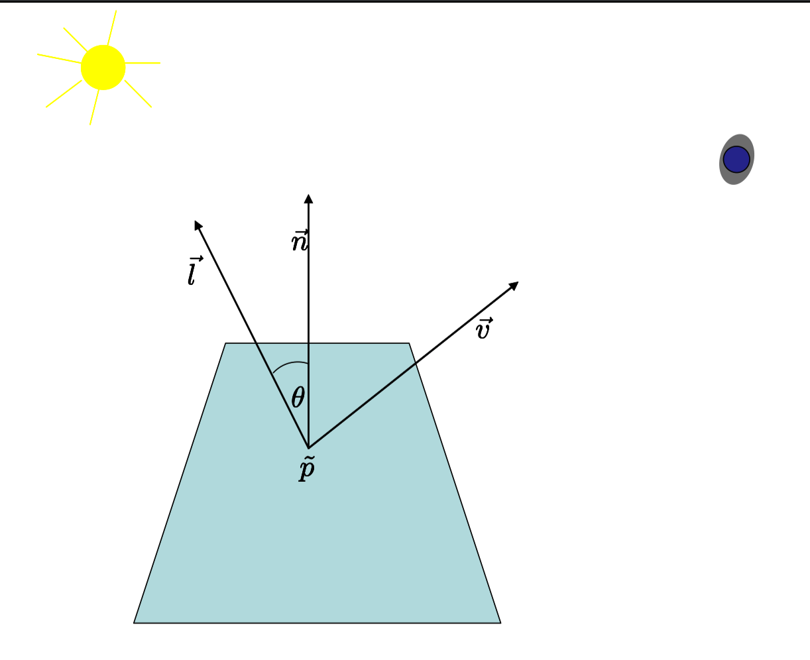
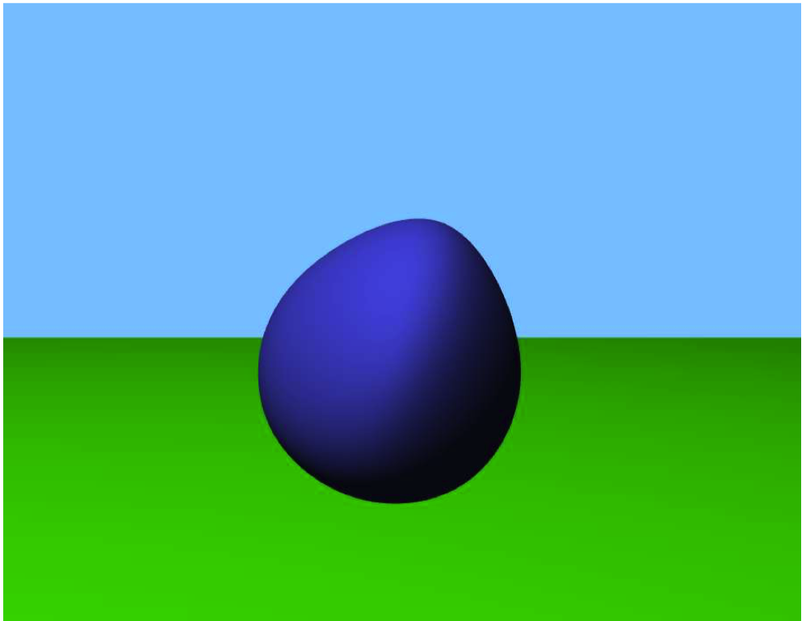
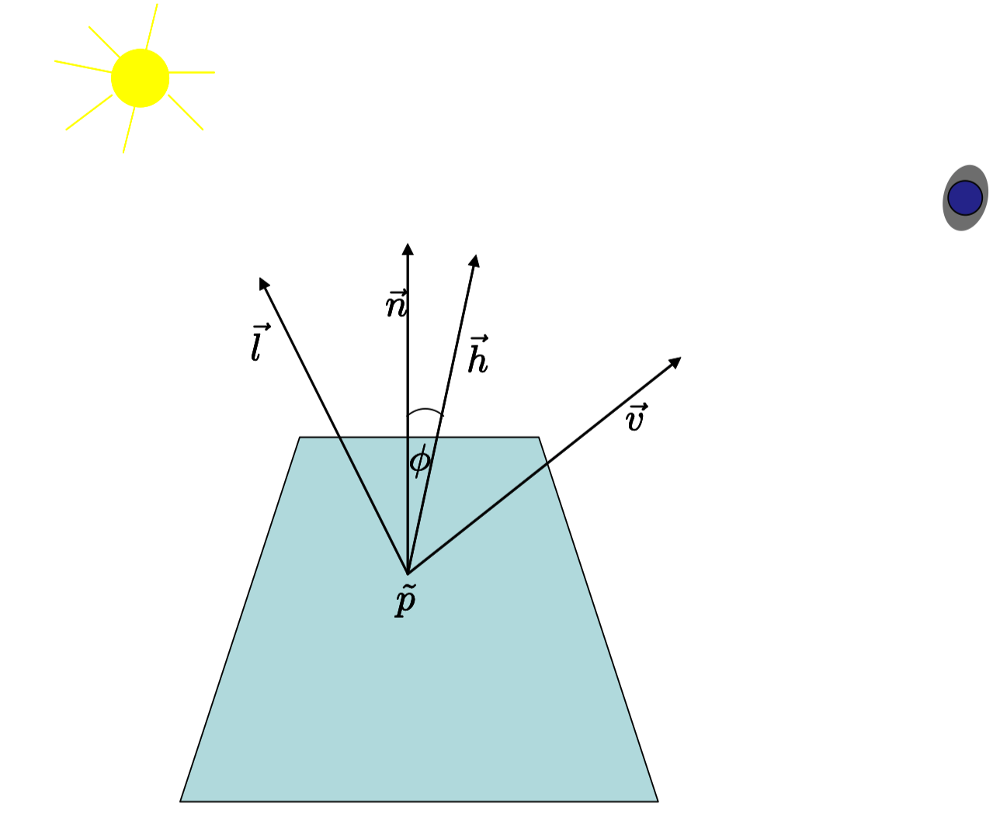
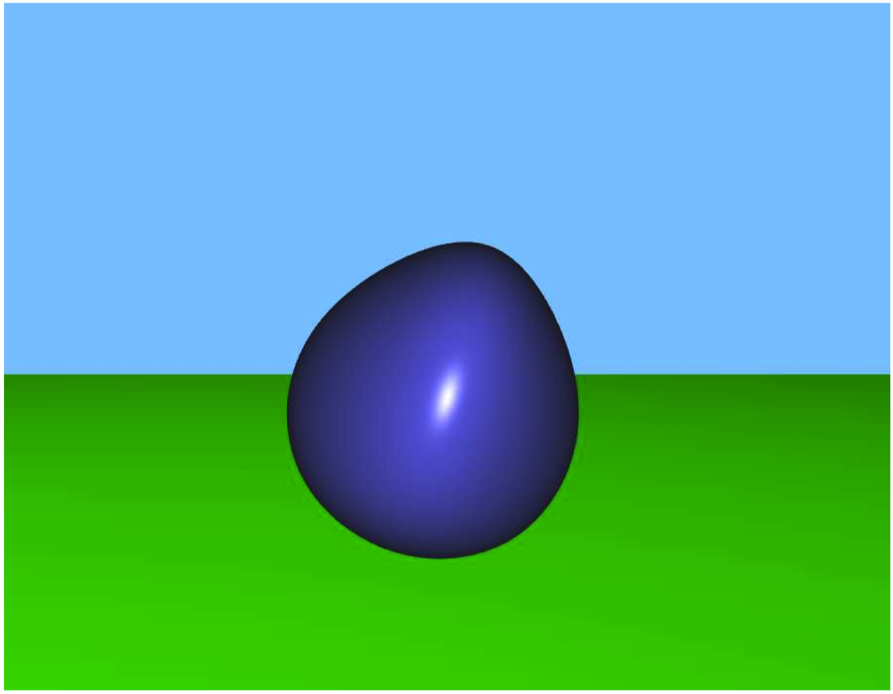
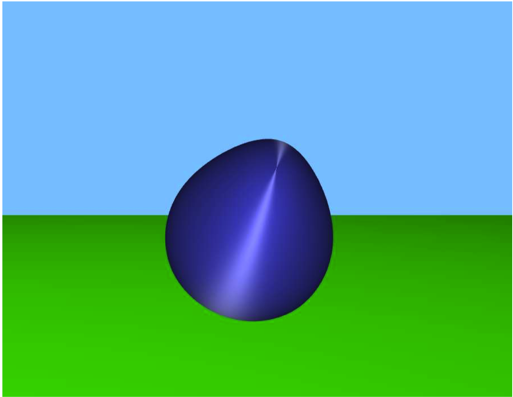

# Note
这是对**MIT Foundation of 3D Computer Graphics**第14章的翻译，本章以简洁明了的方式给出了计算机图形学中光和材料的基本讲解。本书内容仍在不断的学习中，因此本文内容会不断的改进。若有任何建议，请不吝赐教<ninetymiles@icloud.com>。 

> 注：文章中相关内容归原作者所有，翻译内容仅供学习参考。
> 另：Github项目[CGLearning](https://github.com/nintymiles/CGLearning)中拥有相关翻译的完整资料、内容整理、课程项目实现。

# 材料（Materials）
碎片着色器（fragment shader)的职责是决定一个三角形上的点，这个点对应于图像中的一个像素。碎片着色器（fragment shader）拥有对于被插值的变异变量（varying variables）的访问权限，同时还有以uniform（统一参数）变量形式来自于用户程序的数据。Uniforms变量经常被用于描述诸如某种光源位置这类东西，这些值不会逐像素变化。变异变量（varying variables）经常被用于描述点的坐标矢量（比方说，关联于眼睛帧（eye frame）），还有用于点的法线，以及描述这个点上材料属性的参数（比如底层的材料色）。碎片着色器（fragment shader）随后接收这些数据并且同时模拟光如何从这种材料反弹出去，同时产生一个图像中的色彩。本章中，我们将覆盖最常见的这种用于材料模拟的着色就算（shading calculations）。随后的章节中，我们会探索在碎片着色器（fragment shader）中完成的其它主要计算方式：纹理映射。

碎片着色（fragment shading）拥有非常丰富的主题，且处于让计算机生成的图形拥有如它们实际般那样细致和真实效果的核心位置。在OpenGL渲染中也是一个核心主题，并且你应该计划学习更多关于我们在这本书中所覆盖的材料主题。一本好的参考书是**CG Tutorial [19]**；这本书使用CG着色语言而不是我们选择的GLSL，但是在这两种语言间的平移几乎是直接的。另一本好的参考书是**Real-Time Rendering [2]**。更详细的材料描述可以在**Digital Modeling of Material Appearance [17]**书中被找到。

## 14.1 基本假设（Basic Assumptions）
当光线照射在一个物理材料上，会在多个外出方向被散射。不同种类的材料以不同的模式散射光线并且这会导致眼睛或者相机所看到的不同外观。有些材料可能看起来明亮，而另一些则显得模糊。通过模拟这种散射处理，我们能够针对一个被渲染的3D物体给出真实的物理外观。

例如，图示$\text{Figure14.1}$可视化了光线如何从一块PVC材料上的一个点反射开去。光线从被矢量$\vec{l}$所指向的方向射入。团状图（blob）展示了当从塑料上方多个方向观察时，这个点会显得多么明亮。更亮的方向都被上色为红色，同时团状图（blob）的形状在这样明亮的方向会延伸地更远。更模糊暗淡的方向则被上色为蓝色。注意这个图示只是描述了来自特定方向$\vec{l}$的光的结果。对于其它入射方向，我们会需要一个不同的图状图（blob）来可视化有差异的最终散射结果。


**Figure 14.1:** 团状图（blob）展示了光线从一块PVC塑料上如何反弹出去。参考书目[51]，©️Eurographics and Blackwell Publishing Ltd。

从这个图示中，我们看到当从围绕光线的“反射”方向：$B(\vec{l})$的多个聚束方向观看时，塑料显得最明亮。实际上，大多数光在入射方向的反弹方向反射出去（想像光从镜面反弹出去或者一个台球如何从台球桌壁反弹开）。假定一个任意矢量$\vec{w}$（不必然为单位态（unit norm））和一个单位长法线矢量$\vec{n}$,我们可以计算$\vec{w}$的反射矢量为下面的公式：

$$\large{ B(\vec{w}) = 2(\vec{w}.\vec{n})\vec{n} - \vec{w}   \tag{14.1}}$$

参看图示$\text{Figure 14.2}$，这个图示提供了方程式的可视推导。


**Figure 14.2:**反射方向矢量的计算推导。

在OpenGL中，我们可以在顶点着色器（vertex shader）中在顶点解析时模拟这种散射处理，同时仅仅在每个三角形上借助变异变量（varying variables）插值最终的色彩值。针对一个有更高质量要求的外观，我们可以以付出更高的代价，在碎片着色器（fragment shader）中，在每个像素上模拟这种处理。本章中，我们会采用这种基于像素的方法。

要正确理解和模拟光散射，我们要真正懂得用来测量光的正确单位、光散射的真实物理学、还有用来建模散射的正确方程式。在21章中我们将用更多细节讲解这个主题。更进一步，真实的环境中光能够从所有方向朝一个表面照射来，并且在其被完全吸收前，会围绕我们的场景反弹多次。这些问题也会在21章被讲解。本章中，我们将采用计算一个合理外观的更实际的方式，借助物理激发但不是物理精确的方式。

在当前时刻，我们将限制我们在如图示$\text{Figure 14.3}$中的简单环境中，这里我们假设所有光来自一个单点光源，其被光矢量$\vec{l}$所指向。这个光束照射到某个三角形的带有法线$\vec{n}的$点$\tilde{p}$之上。在表面法线和指向光的矢量之间的角度被表示为$\theta$。本环境中，我们想要计算朝向眼睛顺着查看矢量（view vector，$\vec{v}$）反射的光的数量。要处理对应的色彩，我们只会计算3个用RGB表示的反射（RGB坐标部件）数量值。注意RGB的这种用法不是物理精确的（参考后面的19.5节内容）。这些数量随后被直接用于这个像素的RGB数值。我们会假设点和矢量的所有坐标被关联于眼睛帧（eye frame）所记录。

就如以前所提及的（参考图示$\text{Figure 6.1}$),法线不必是扁平几何体的“真正法线”。相反，法线可以被用户在每个顶点所指定，同时可以作为变异变量（varying variable）被插值。以这种方式，在材料模拟中，我们可以使用平滑的变异（varying）法线获得平滑的外观。


**Figure 14.3:**这里我们展示被用在一个表面点$\tilde{p}$上的多个矢量去确定这个点的色彩。

## 14.2 漫射材料（Diffuse）
漫射材料，像粗糙的木头，当从各个方向$\vec{v}$观看时会显得一样亮。如此，当在一个漫射材料上计算一个点的色彩，我们完全不需要使用$\vec{v}$矢量。当光线从“上面”照射漫射材料时，它们会显得更加明亮。而当光线以一种掠过角度照射时，这些材料就显得模糊。这是因为（参考21章）照射在一小块固定尺寸的漫射材料上的入射光子的数量成比例于$cos(\theta) = \vec{n}.\vec{l}$。基于这些假设，我们可以用下面的碎片着色器（fragment shader）计算漫射材料的色彩 - 这个着色器我们也在之前的6.4节中使用过。

```
#version 330

uniform vec3 uLight;

in vec3 vColor; 
in vec3 vNormal; 
in vec4 vPosition;

out fragColor;

void main(){ 
	vec3 toLight = normalize(uLight - vec3(vPosition)); 
	vec3 normal = normalize(vNormal); 
	float diffuse = max(0.0, dot(normal, toLight)); 
	vec3 intensity = vColor * diffuse; 
	fragColor = vec4(intensity.x, intensity.y, intensity.z, 1.0); 
}
```
**normalize**函数的调用被用于确保被插值的矢量拥有单位态（unit form）。**max**函数的调用被用于保证我们不会尝试产负光-当位于那些背离光源点上时。漫射计算的值被用于调和内生的表面色-这种色彩被通过vColor顶点属性传入。

我们借助这种shader绘制我们的简单立方体图示，比如$\text{Figure 5.1}$,还有在$\text{Figure 14.4}$中的卵形形状。

这种着色器可以被轻松地以多种方式扩展。

- 本章中，光本身没有被给定其自身的一种色彩。这也可以被轻松地使用另一个uniform变量附加的方式建模。
- 多光源也可以被轻松添加进来。
- 真实世界中，光围绕一个场景反弹多次，并且因此总是有光从每个方向照射每个表面。这种情况可以被非常粗鲁地被建模在我们的计算中-仅需将某种常量环绕色（ambient color）加到当前的强度（intensity）上即可。
- 有时，建模来自于一个（被一个矢量所描述，而不是来自于一个点的）方向的光会更加方便。在这种情形中，当建模这一种方向光源时，矢量toLight会作为一个uniform变量被传入。


**Figure 14.4:** 一个被漫射方式着色的卵形形状。

## 14.3 光亮材料（Shiny）
很多材料，就像塑料，不是漫射特征；针对固定数量的入射光分布，当从某些方向观察时，它们看起来更明亮；而从其它方向观察时它们就显得模糊。圆形的由这种材料制成的对象只要表面法线指向“正好正确”在其表面就会出现明亮的高亮。这种针对一种特定材料的反射行为的确切形式可以被测量。反射行为也常常可以借助“微镜面”理论[14]被预测。这种理论中，你可以想象材料由多种微小的真正镜面构成，这些镜面以某种可统计的方式与光线交互。

一种简单但某种意义上又合理的常常用于实践的计算，其仅仅计算光线的反射矢量$B(\vec{l})$,然后再计算它与查看矢量$\vec{v}$的角度。当反射和查看矢量被良好对齐时，我们就绘制一个非常亮的像素。当它们不被良好对齐时，我们就绘制一个模糊的像素。

还有一种甚至更简单的方式可以获得相同的效果，就是首先计算半路矢量（halfway vector）$\vec{h} = normalize(\vec{v}+\vec{l})$,随后再测量半路矢量与法线$\vec{n}$之间的角度$\phi$。参考图示$\text{Figure 14.5}$。，只有当$\vec{v}$与$\vec{l}$良好对齐时，矢量$\vec{h}$与矢量$\vec{n}$也才会对齐。我们借用点积计算$\phi$的cosine值，这会给出我们一个位于[0..1]之间的值，这个值会随着矢量$\vec{h}$与矢量$\vec{n}$的分离而衰减。要建模光亮材料（shiny material），我们会让亮度随着角度快速衰减，因而我们随之提升$\cos(\phi)$为一个正数幂形式（下面代码中使用数字64）。

**Figure 14.5:** 此处我们展示了用于给一个闪亮材料着色的矢量。

把这些思路全部汇总到一起，我们得到如下的着色器（shader）：

```
#version 330

uniform vec3 uLight; 

in vec3 vColor; 
in vec3 vNormal; 
in vec4 vPosition;

out fragColor;

void main(){ 
	vec3 toLight = uLight - vec3(vPosition);
	vec3 toV= -normalize(vec3(vPosition)); 
	toLight = normalize(toLight); 
	vec3 h = normalize(toV + toLight); 
	vec3 normal = normalize(vNormal);

	float specular = pow(max(0.0, dot(h, normal)), 64.0); 
	float diffuse = max(0.0, dot(normal, toLight)); 
	vec3 intensity = vec3(0.1,0.1,0.1) + vColor * diffuse + vec3(0.6,0.6,0.6) * specular;

	fragColor = vec4(intensity.x, intensity.y, intensity.z, 1.0);
}
```

矢量$\vec{v}$的坐标，（此处存储在一个名称为toV的变量中）实际上很容易计算，因为，在眼睛坐标中，眼睛的位置和原点重合。同时也要注意，在本代码中，反射部件为白色，此处高亮处匹配入射光的色彩，而无关材料色。

我们已经使用了这种着色器（shader）去绘制我们的卵形形状，就如在图示$\text{Figure 6.1}$中，同时还有本章在图示$\text{Figure 14.6}$中。


**Figure 14.6:** 一个光亮着色的卵形

## 14.4 各向异性材料（Anisotropy）
前面两种材料模型，还有很多其它的，拥有各项同性（isotropy）的属性。这意味着没有针对表面的具有优先级的“粒度”。有关联的因素是光矢量、查看矢量、和法线矢量的几何特征。作为对比，有些材料，比如拉绒的金属，以各向异性的方式展现行为。如果你拿着一块扁平的这种材料然后围绕其法线旋转，材料的外观会改变。建模这种材料时，我们会假设一个优先的正切矢量$\vec{t}$以某种方式被包括在模型中，同时被传给着色器（shader）。参考图示$\text{Figure 14.7}$。下面我们展示一个着色器（shader,在[42]中有描述），基于Kajiya和Kay[33]推导的模拟光从各向异性的毛绒表面反射的方程式。这些方程式基于表面由微小的圆柱体构成来推导；这个推导的细节超越本书的范围。

```
#version 330 

uniform vec3 uLight; 

in vec3 vColor; 
in vec3 vNormal; 
in vec4 vPosition; 
in vec4 vTangent; 
out fragColor; 

void main(void){
	vec3 toLight = normalize(uLight - vec3(vPosition)); 
	vec3 toV = -normalize(vec3(vPosition)); 
	toLight = normalize(toLight); 
	vec3 h = normalize(toV + toLight); 
	vec3 normal = normalize(vNormal);

	vec3 vTangent3 = vec3(pvTangent);

	vTangent3=normalize(cross(vNormal,vTangent3));

	float nl = dot(normal, toLight); 
	float dif = max(0,.75 * nl+.25);
	float v = dot(vTangent3, h); 
	v = pow(1.0 - v * v, 16.0);

	float r = pColor.r * dif + 0.3 * v; 
	float g = pColor.g * dif + 0.3 * v; 
	float b = pColor.b * dif + 0.3 * v;

	fragColor = vec4(r, g, b, 1);
}
```

我们已经使用这个着色器渲染了图示$\text{Figure 14.8}$中的卵形形状。


**Figure 14.7:** 建模各向异性的材料，我们也需要包括一个优先的正切矢量。


**Figure 14.8:** 以各向异性方式着色（anisotropically shaded）的卵形


