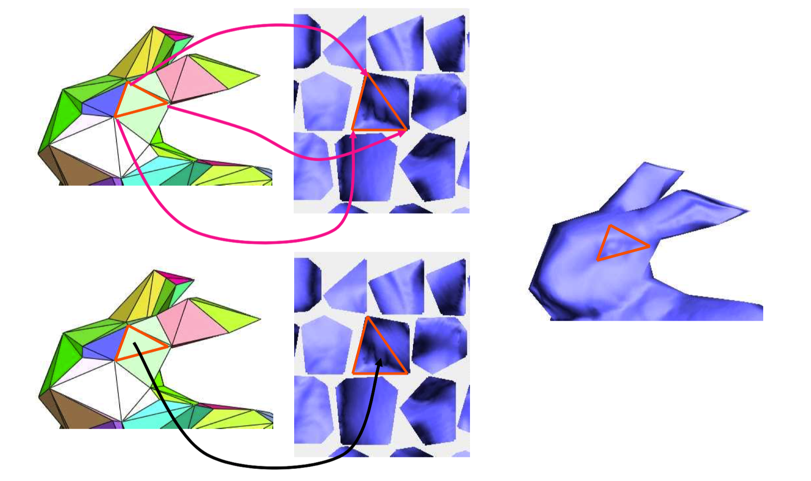
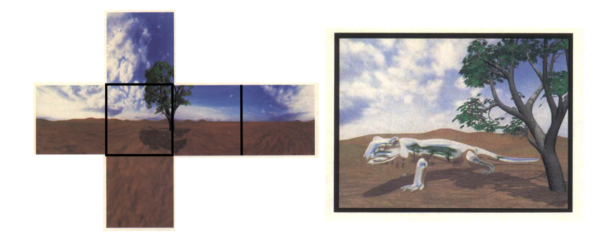
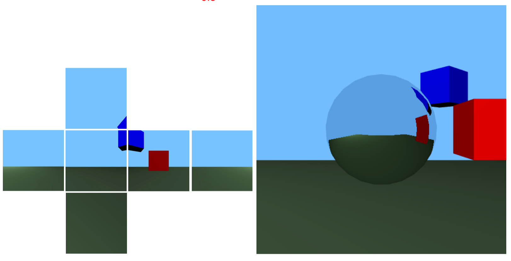
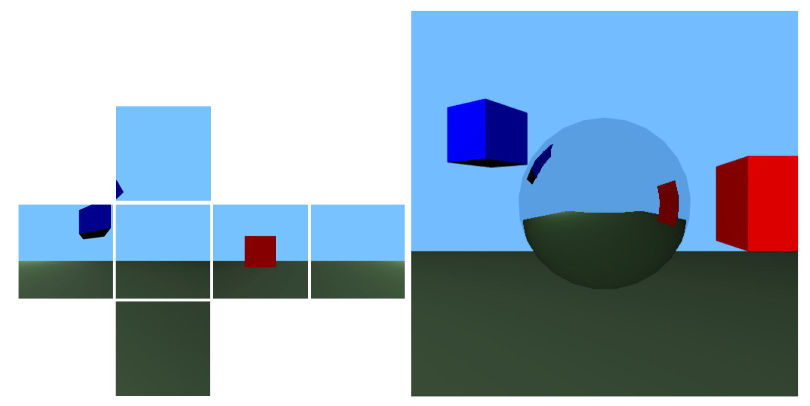

# 纹理映射（Texture Mapping）
在第14章中，我们看到了在光和材料之间的一个简单交互模型是如何被用来计算一个像素的色彩。通常被碎片着色器（fragment shader）用来计算一个像素色彩的另一种重要工具是从一个被称作纹理的辅助图像中提取数据。在本章中我们会探索基本纹理映射（basic texture mapping），同时还会包含它的多个变体。这样的技术正是让我们的渲染显得细致和内容丰富的主要工具。

图示$\text{Figure 15.1}$展示了一个纹理映射的简单例子。在其左侧，我们看到了一个用几十个三角形构成的简单模型。其中一个三角形被高亮为红色。我们给每个三角形的每个顶点关联一个纹理坐标$x_t,y_t$（参考图示上部）。这些坐标“映射”每个顶点纹理中的某个位置。纹理坐标随后在三角形范围内被插值（参考图示底部），如此就针对每个像素给出了纹理坐标。碎片着色器（fragment shader）随后抓取被纹理坐标所指向的纹理色彩，并且将其发送到帧缓存（framebuffer）。最终被渲染的图像展示在图示的右侧。

## 15.1 基础纹理映射 （Basic Texturing）
基础纹理映射中，我们只是“粘贴”一个图像的局部到一个三角形上，这个动作通过在三角形的三个顶点上指定纹理坐标的方式完成。在这个模型中，我们假设每个变量$x_t$和$y_t$都是一个三角形上的函数，而这些函数在对象坐标上具有并行的特点。这种情形允许我们在粘合过程中平移、选择（甚至缩放和切削）纹理图片。

用于加载一个纹理的代码在附录小节A.4中已经被描述。正如在那里所讲的，一个uniform变量被用于指向想要的纹理单位，这个纹理单位对于在这个绘制调用中的所有像素都是相同的。变异变量（varying variables）被用于在顶点上存储纹理坐标，这些纹理坐标指向纹理中某个特定2D地址。

下面，我们描述相关的用于基础纹理映射所需着色器（shaders）。在这个基础的纹理映射例子里，顶点着色器（vertex shader）只是将纹理坐标作为变异变量传递到碎片着色器（fragment shader）中。

```
#version 330
uniform mat4 uProjMatrix; 
uniform mat4 uModelViewMatrix;

in vec2 aTexCoord; 
in vec4 aVertex;

out vec2

vTexCoord;
void main(){ 
	vTexCoord = aTexCoord; 
	gl_Position = uProjMatrix * uModelViewMatrix * aVertex; 
}
```

下面的碎片着色器（fragment shader）随后使用这些被插值的纹理坐标来从纹理中寻找想要的色彩数据，并且将其设置到帧缓存（framebuffer）中。

```
#version 330
uniform sampler2D uTexUnit0;

in vec2 vTexCoord; 

out fragColor

void main(){ 
	vec4 texColor0 = texture2D(uTexUnit0, vTexCoord); 
	fragColor = texColor0; 
}
```

数据类型sampler2D是一种特殊的GLSL数据类型，用于指向一个OpenGL纹理单位（texture unit）。对texture2D的调用会获取来自纹理单位的一个色彩值。（注：此处实际上是texture()函数调用。）

在这种最简单的理想化情形中，我们只是从纹理中获取r、g、b的数值并且直接发送它们到帧缓存（framebuffer）中。可选地，纹理数据可以被解释为，比方说，不同的表面点的材料色，这然后会跟着被在14.2节中所描述的漫射表面计算所使用。


**Figure 15.1:** 顶部：一个三角形的每个顶点都被给出x，y纹理坐标。这些坐标指向纹理图像中。底部：这些坐标被在像素解析时插值为变异变量（varying variables）。在碎片着色器（fragment shader）中，我们通过这些纹理坐标抓取其所指向的色彩，同时在渲染中使用这个色彩（右侧）。参考[65],ACM。

## 15.2 法线映射（Normal Mapping）
来自一个纹理的法线也可以更有趣的方式被解读。在法线映射中，来自一个纹理的r、g、b数值被解读为当前点法线的3个坐标。这种法线数据随后会被用作某种材料模拟计算的一部分，就如在14章中所描述的。参看这种情形的实例图示$\text{Figure 15.2}$

法线数据有3种坐标值，每个都位于范围$[-1..1]$,而RGB纹理存储的3个数值，每个都处于范围$[0..1]$。因此，法线数据在被存储为纹理之前需要被转换为这种格式，就如在代码`r = normal_x/2. +.5;`中的转换。反之，你的碎片着色器（fragment shader）需要恢复这种转换，就如在代码`normal_x = 2r-1;`中的转换。


**Figure 15.2:** 在左侧，我们展示了一个茶壶模型的渲染。茶壶使用平滑插值的法线被着色，同时三角形边缘被展示。(©️Hugues Hoppe)。在右侧，我们展示了相同的表面，但是现在茶壶却是被来自高解析度纹理中所提取的法线域所渲染。这些法线被使用在光照计算中。并且给出了高解析度几何细节效果。参考[54],©️ACM。

## 15.3 环境立方体映射（Environment Cube Maps）
纹理也可以在围绕被渲染物体的距离上建模环境。在这种情形中，我们通常使用6个正方形纹理表达一个环绕场景的大立方体的面。每个纹理像素表达顺着环境中一个方向看过去的色彩。这就被称为立方体映射。GLSL提供了一个专门用于立方体纹理（cube-texture）目的的数据类型-samplerCube。在一个点的着色过程中，我们将那个点的材料处理为一个完美镜面并且从合适的入射方向获取环境数据。一个例子被展示在图示$\text{Figure 15.3}$中。

实现这个思路，我们采用方程（14.1）来计算被反射的查看矢量$B(\vec{v})$。这个反射矢量会指向环境方向，这个方向会在镜面化的表面被观察到。通过借助这个方向查找立方体纹理映射，我们给予了这个表面一个镜子的外观。

```
#version 330 

uniform samplerCube texUnit0;

in vec3 vNormal; 
in vec4 vPosition;

out fragColor;
vec3 reflect(vec3 w, vec3 n){
	return - w + n * (dot(w, n) * 2.0); 
}

void main(void){
	vec3 normal = normalize(vNormal); 
	vec3 reflected = reflect(normalize(vec3(-vPosition)), normal); 
	vec4 texColor0 = textureCube(texUnit0,reflected);

	fragColor = vec4(texColor0.r, texColor0.g, texColor0.b, 1.0);
}
```
在眼睛坐标中，眼睛的位置和原点重合，因此`-vPostion`表达了查看矢量$\vec{v}$。textureCube为一个特殊的GLSL函数，这个函数接收一个方向矢量同时返回立方体纹理映射中在这个方向上所存储的色彩。

这段代码中，我们的所有矢量被以眼睛坐标的方式表达，同时我们也假设立方体纹理以眼睛坐标方式表达环境数据。比方说，如果我们的环境纹理正在用世界坐标表达方向，那么被渲染点的恰当坐标需要被传递到碎片着色器（fragment shader）。

这种完全相同的思路，除了代替镜面反射建模折射外，已经被用于生成图示$\text{Figure 22.4}}$中的喷泉图像。


**Figure 15.3:** 在左侧，环境被存储为一个立方体纹理（cube texture）。其被用来渲染一个镜面化的蜥蜴。参考[25],©️IEEE。

## 15.4 投影仪纹理映射（Projector Texture Mapping）
经常我们会想以投影仪模型去粘贴我们的纹理到三角形上，而不是采用在15.1节中所述的并行粘贴模型。例如，我们可能希望模拟滑动投影仪照亮空间中的某些三角形。（参考图示$\text{Figure 15.4}$）。这种行为并不像其刚出现时那样不正常。例如，假设我们以及拍摄了一张建筑的正面照片，随后希望恰当地将其粘贴到建筑的电子3D模型之上。要完成这种粘合动作，我们应反转相机成像处理的几何过程-通过在相对于建筑的相同位置将相机替换为虚拟滑动投影仪的方式。

在滑动投影仪映射中，滑动投影仪被借助$4\times 4$模型试图（modelview）矩阵-$M_s$和投射（projection）矩阵-$P_s$建模。确定了如下关系：

$$\large{ 
	\begin{bmatrix} x_tw_t \\ y_tw_t \\ z_tw_t \\ w_t \end{bmatrix} 
	=
	P_sM_s \begin{bmatrix} x_o \\ y_o \\ z_o \\ 1 \end{bmatrix} 
	\qquad (15.1) 
}$$

那么让投影仪映射的纹理坐标（texture coordinates）被定义为$x_t = x_tw_t/w_t,y_t = y_tw_t/w_t$。要为用对象坐标$[x_o,y_o,z_o,1]^t$表达的一个三角形上的点着色，我们就获取存储在地址$[x_t,y_t]^t$处的纹理数据。参考图示$\text{Figure 15.6}$

Due to the division by w t , the values x t and y t are not affine functions of (x o , y o , z o ), and thus would not be appropriately interpolated if directly implemented using varying variables. But, from Section B.5, we see that, indeed, the three quantities x t w t , y t w t and w t are all affine functions of (x o , y o , z o ). Thus these quantities will be properly interpolated over a triangle when implemented as varying variables. In the fragment shader, we need to divide by w t to obtain the actual texture coordinates.

When doing projector texture mapping, we do not need to pass any texture coordinates as attribute variables to our vertex shader. We simply use the object coordinates already available to us. We do need to pass in, using uniform variables, the necessary projector matrices. Here is the relevant part of our vertex shader.

```
#version 330 
uniform mat4 uModelViewMatrix; 
uniform mat4 uProjMatrix;
uniform mat4 uSProjMatrix; 
uniform mat4 uSModelViewMatrix;

in vec4 aVertex; out vec4 avTexCoord;

void main(){ 
	vTexCoord= uSProjMatrix * uSModelViewMatrix * aVertex; 
	gl_Position = uProjMatrix * uModelViewMatrix * aVertex; 
}
```

And our fragment shader is

```
#version 330
uniform sampler2D vTexUnit0;

in vec4 vTexCoord; 
out fragColor

void main(void){ 
	vec2 tex2; 
	tex2.x = vTexCoord.x/vTexCoord.w; 
	tex2.y = vTexCoord.y/vTexCoord.w; 
	vec4 texColor0 = texture2D(vTexUnit0, tex2); 
	fragColor= texColor0; 
}
```

> Full disclosure: to produce the image of Figure 15.4, in our vertex shader we also computed the normal at each vertex in the “eye” coordinates of the projector. A diffuse lighting equation was then added to our fragment shader to modulate the texture color. As a result, the top face in the image is a bit dimmer than the rightmost face.

Conveniently, OpenGL even gives us a special call texture2DProj(vTexUnit0, pTexCoord), that actually does the divide for us. Inconveniently, when designing our slide projector matrix uSProjMatrix, we have to deal with the fact that (as described in Section 12.3.1), the canonical texture image domain in OpenGL is the unit square whose lower left and upper right corners have coordinates [0, 0] t and [1, 1] t respectively, instead of the canonical square from [−1, −1] t to [1, 1] t used for the display window. Thus the appropriate projection matrix passed to the vertex shader would be of the form makeTranslation(Cvec3(0.5,0.5,0.5)) * makeScale(Cvec3(0.5,0.5,1)) * makeProjection(...).


**Figure 15.4:** The checkerboard image is slide projected on to the front and top faces of the cube. 棋盘图像被滑动投射到立方体的前脸和顶部面


**Figure 15.5:** Left: Actual photograph. Middle: Rendered geometric model. Right: c Rendered with projector texture mapping. From [15], ⃝ACM. 左侧：实际相片。中间：渲染的几何模型。右侧：用投影仪纹理映射渲染的图像。来自参考书目[15],©️ACM.


**Figure 15.6:** In projector texture mapping, to determine the color of a point observed in the eye’s camera, we map this to the a point in the “projectors image”. The color from this texture is used to color the point.

## 15.5 多通道（Multipass）
More interesting rendering effects can be obtained using multiple rendering passes over the geometry in the scene. In this approach, the results of all but the final pass are stored offline and not drawn to the screen. To do this, the data is rendered into something called a frameBufferObject, or FBO. After rendering, the FBO data is then loaded as a texture, and thus can be used as input data in the next rendering pass. For coding details on FBOs you might start with [53].

### 15.5.1 反射映射（Reflection Mapping）
Reflection mapping is a simple example of multipass rendering. In this case, we want one of the rendered objects to be mirrored and reflect the rest of the scene. To accomplish this, we first render the rest of the scene as seen from, say, the center of the mirrored object. Since the scene is 360 degrees, we need to render six images from the chosen viewpoint, looking right, left, back, forth, up and down. Each of these six images has a 90 degree vertical and horizontal field of view.

This data is then transferred over to a cube map. The mirrored object can now be rendered using the cube map shaders from Section 15.3. See Figures 15.7 and 15.8 for an example. This calculation is not completely correct, since the environment map stores the view of the scene as seen from one point only. Meanwhile, true reflection needs to look at the appropriate bounced ray from each point of the object (see Figure 15.9). Nonetheless, for casual use, reflection mapping can be quite effective.


Figure 15.7: In reflection mapping, the scene (floor and cubes) is first rendered into a cube map. This is used as environment map to render the mirrored sphere.


Figure 15.8: The blue cube is moved. The cube map is recreated and the image redrawn.


Figure 15.9: To correctly render a mirrored sphere, we need to follow a set of bounce rays that do not all intersect in a single point.

### 15.5.2 阴影映射（Shadow Mapping）
In our simple material calculations of Chapter 14, the color computation at a point does not depend on any of the rest of the geometry in the scene. Of course, in the real world, if some occluding object is situated between a surface point and the light, the point will be in shadow and thus be darker. This effect can be simulated using a multipass technique called shadow mapping. The idea is to first create and store a z-buffered image from the point of view of the light, and then compare what we see in our view to what the light saw in its view. See Figure 15.10. If a point observed by the eye is not observed by the light, then there must be some occluding object in between, and we should draw that point as if it were in shadow.

In a first pass, we render into an FBO the scene as observed from some camera whose origin coincides with the position of the point light source. Let us model this camera transform as:

⎡ ⎤ ⎡ ⎤ x t w t x o ⎢ y t w t ⎥ ⎢ y o ⎥ ⎢ ⎥ ⎢ ⎥ ⎣ z t w t ⎦ = P s M s ⎣ z o ⎦ w t 1

for appropriate matrices, P s and M s . During this first pass, we render the scene to an FBO using M s as the modelview matrix and P s as the projection matrix. In the FBO, we store, not the color of the point, but rather its z t value. Due to z-buffering, the data stored at a pixel in the FBO represents the z t value of the geometry closest to the light along the relevant line of sight. This FBO is then transferred to a texture.

During the second rendering pass, we render our desired image from the eye’s point of view, but for each pixel, we check and see if the point we are observing was also observed by the light, or if it was blocked by something closer in the light’s view. To do this, we use the same computation that was done with projector texture mapping in Section 15.4. Doing so, in the fragment shader, we can obtain the varying variables x t y t and z t associated with the point [x o , y o , z o , 1] t . We then compare this z t value with the z t value stored at [x t , y t ] t in the texture. If these values agree (to within a small precision tolerance), then we are looking at a point that was also seen by the light; such a point is not in shadow and should be shaded accordingly. Conversely, if these values disagree, then the point we are looking at was occluded in the light’s image, is in shadow, and should be shaded as such. See Figure 15.11 for an example.

Figure 15.10: In shadow mapping, we first render an (FBO) image from the point of view of the light. Only depth values are stored in this image. In a second pass, we render the scene from the point of view of our eye. Using the same mathematics from projector texturing, for every point observed by the eye, we can compare its light-depth to that stored in the light’s image. If these agree (orange and green points), the point was seen by the light, and we color it appropriately. If these disagree (purple), then the point was occluded from the eye and is in shadow, and we color it differently.


Figure 15.11: In shadow mapping, the scene is first rendered from the point of view of the light (visualized on the left). The depth values are stored in a texture. In the second pass the light texture data is used to determine if the surface point is directly observed by the light. This gives us the final rendered image on the right. ⃝Hamilton c Chong.


