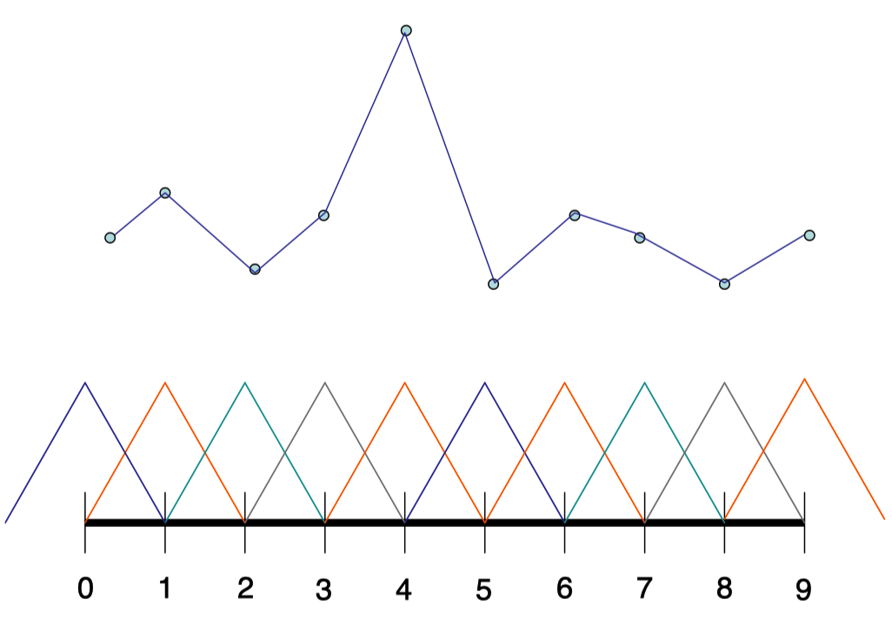

# Note
这是对**MIT Foundation of 3D Computer Graphics**第17章的翻译，本章讲解了常量重建和双线性重建两种重建算法的基础知识。本书内容仍在不断的学习中，因此本文内容会不断的改进。若有任何建议，请不吝赐教<ninetymiles@icloud.com> 

> 注：文章中相关内容归原作者所有，翻译内容仅供学习参考。
> 另：Github项目[CGLearning](https://github.com/nintymiles/CGLearning)中拥有相关翻译的完整资料、内容整理、课程项目实现。

# 重建（Reconstruction）
现在让我们关注对立问题：假定一个具体图像$I[i][j]$，我们怎样生成一个连续图像$I(x,y)$？正如我们将会看到的，这个问题对于图像尺寸调整以及纹理映射是中心问题。例如，在碎片着色器中，我们可能希望借助落入（两个）纹理像素之间的纹理坐标从纹理中获取色彩。在这种情形中，我们需要决定使用什么纹理色彩。这个处理被称为重建。

## 17.1 常量重建（Constant）
让我们再次假设我们的像素对应整数值化的(x,y)地址，同时我们希望在某种小数值化的地址处决定一个色彩。可能最容易的图形重建方式为常量重建（或称作最近邻居）方法。在这种方法中，一个实数值化的图像坐标被假定拥有最近的具体像素的色彩。这种方法可以借助下面的伪码描述

```c
color constantReconstruction(float x, float y, color image[][]){ 
	int i = (int) (x + .5); //四舍五入到整型值
	int j = (int) (y + .5);  
	
	return image[i][j] 
}
```
这种“(int)”类型转换近似了一个数字p为不大于p的最近的整数。

我们把这种方法当作是定义了在连续(x,y)域上的连续图像。我们称此为“常量重建（constant reconstruction）”，因为最终的连续图像由常量色彩的小正方形块组成。例如，图像在正方形区域：$−.5 < x < .5$和$−.5 < y < .5$中拥有常量值$I[0][0]$。每个像素拥有$1\times1$的影响范围。参考图示$\text{Figure 17.1}$的左侧。


**Figure 17.1:** 顶部行：一个$64\times64$具体图像。底部左侧：使用常量重建方式被重建。底部右侧：借助双线性重建被重建。©️Yasuhiro Endo。

## 17.2 双线性重建（Bilinear）
常量重建产生块状外观的图像。我们可以借助双线性插值生成更平滑外观的重建。双线性插值通过在水平和垂直方向都线性插值被获得。它可以通过下面的代码被描述：

```
color bilinearReconstruction(float x, float y, color image[][]){

float int intx = (int) x; 
float int inty = (int) y; 
float fracx = x - intx; 
float fracy = y - inty;

colorx1 = (1-fracx) * image[intx] [inty] + (fracx) * image[intx+1][inty]; 
colorx2 = (1-fracx) * image[intx] [inty+1] + (fracx) * image[intx+1][ inty+1];

colorxy = (1-fracy) * colorx1 + (fracy) * colorx2;

return(colorxy)
}
```
在这种代码中，我们首先在x坐标上应用线性插值，跟着在y坐标上应用前面结果的线性插值。

在整数坐标上，我们有$I(i, j) = I[i][j]$；重建的连续图像$I$认同具体图像$I$。在整数坐标之间，色彩值被连续混合。每个具体图像中的像素以一种可变的程度影响着连续图像中$2\times2$正方形区域中的每个点。图示$\text{Figure 17.1}$比较了常量和双线性重建。

让我们更仔细一点观察坐标$i < x < i + 1, j < y < j + 1$所确定的$1\times1$正方形，其中i和j为某种固定值。在这个正方形上，我们可以表达重建为
$$\normalsize{ \begin{array}{rl}
I(i + x_f , j + y_f ) & \leftarrow  & (1 − y_f )((1 − x_f )I[i][j] + (x_f)I[i + 1][j])  \\
 & & +(y_f)((1 − x_f )I[i][j + 1] + (x_f)I[i + 1][j + 1]) 
\end{array} \qquad\qquad \tag{17.1} }$$
此处$x_f$和$y_f$为上面的`fracx`和`fracy`。重新排列各项我们得到
$$\normalsize{ \begin{array}{rrl}
I(i + x_f , j + y_f) & \leftarrow & I[i][j]\\
&& + (−I[i][j] + I[i + 1][j])x_f \\
&& + (−I[i][j] + I[i][j + 1])y_f \\
&& + (I[i][j] − I[i][j + 1] − I[i + 1][j] + I[i + 1][j + 1])x_fy_f
\end{array} }$$
完成上面步骤，我们看到重建函数在变量$(x_f,y_f)$上拥有常量项，线性项，和双线性项，因此在$(x,y)$上也是相同的情况。这就是双线性名称的来源。同时这也清晰无误地表明了这种重建对于水平和垂直方向是对称的，因而伪码中水平优先的顺序表达不是影响对错的关键因素。

## 17.3 基础函数（Basis Functions）
要获得重建方法通用形式的更多内审，我们可以返回到方程（17.1）然后重新排列各项获得
$$\normalsize{ \begin{array}{rrl}
I(i + x_f , j + y_f) & \leftarrow & (1 − x_f − y_f + x_fy_f)I[i][j] \\
&& +(x_f − x_fy_f)I[i + 1][j] \\
&& +(y_f − x_fy_f)I[i][j + 1] \\
&& +(x_fy_f)I[i + 1][j + 1]
\end{array} }$$
在这种形式中，我们看到对于一个固定位置$(x,y)$，连续重建的色彩位于I的具体像素值中。因为这在所有的$(x,y)$上都是真实的，对于函数$B_{i,j}(x,y)$的某种合适选择，我们看到事实上重建一定是这种形式 
$$
I(x, y) \leftarrow \sum_{i,j}B_{i,j}(x, y)I[i][j] \tag{17.2}
$$

这些B函数被称作基函数（basis functions）；它们描述了像素$i,j$多大程度上影响$[x,y]^t$处的连续图像。

在这种双线性重建中，这些B函数被称作帐篷函数（tent functions），它们被定义如下：让$H_i(x)$为单变量帽子函数（hat functions）定义为
$$ \begin{array}{c}
H_i(x) & =  & x−i+1  & for & i−1<x<i  \\
				&& −x+i+1 & for & i<x<i+1 \\
				&& 0  & else &
\end{array}$$
参考图示$\text{Figure 17.2}$。（在1D中，帽子基（hat basis）可以被用于接收在整数值范围上的一个值的集合同时线性插值它们以获得一个连续的单变量函数。）那么，让$T_{i,j}(x,y)$为双变量函数
$$T_{i,j}(x, y) = H_i(x)H_j(y)$$


**Figure 17.2:** 一个帽子基（hat basis）由10个基函数组成。当被线性插值，它们可以生成具体值上（显示为圆点）逐段线性插值。

这被称作一个帐篷函数（参考图示$\text{Figure17.3}$）。可以验证把这些帐篷函数插入方程（17.2）中会给出我们双线性重建算法的结果。


**Figure 17.3:** 一个双线性帐篷函数（tent function）的四个四分之一圆周视图。在其中心值为1，并且在$2\times2$像素正方形边缘其值降为0.

重来重建也可以用这种形式被建模，但是在这种情形中，基函数$B_{i,j}(x,y)$为盒式函数，其除了围绕坐标$(i,j)$的正方形区域中拥有常量值为1之外，其余处处都为0.

更通用地情形中，我们可以选择各种尺寸和形状的基函数。在高质量图像编辑工具中，比如，重建借助参考书目[50]中的某种双-立方基函数（bi-cubic basis functions）被实现。在这种意义上，像素不真正为一个小正方形。它只是一个具体值，其被用于联合基函数集合以获得一个连续函数。


### 17.3.1 边缘保留（Edge Preservation）
线性方法，尤其那些借助方程（17.2）重建一张图像的线性方法，仅只是在具体像素之间进行简单填充。当我们靠近观察重建的连续图像，边缘会显得模糊掉了。存在有更高级的非线性技术，这些技术甚至在重建时也尝试维护锋利（立即过渡）的边缘，但是超越了我们的学习范围。关于这个主题的更多资料，参考$[18]$及其中的参考文献。


